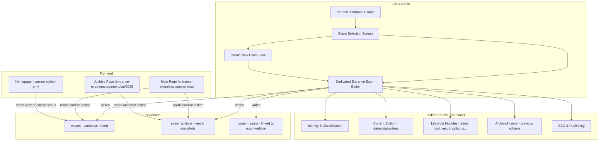
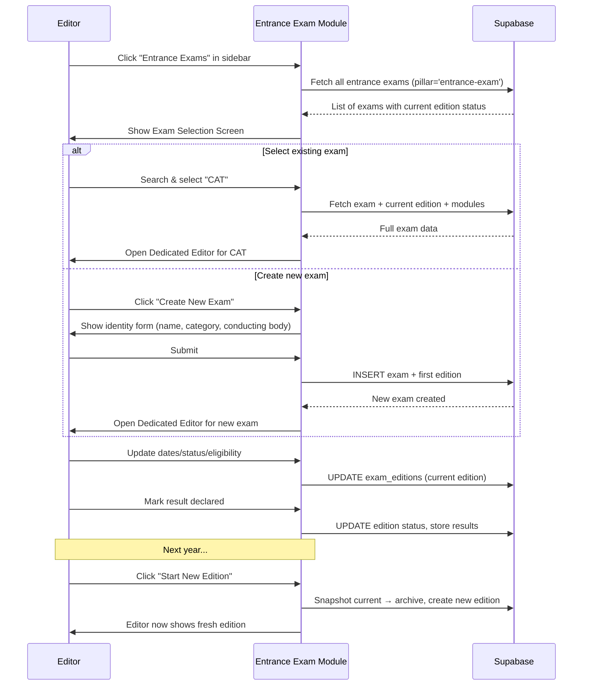

# Design Document: Entrance Exam Editorial Workflow

## Overview

Refactors the Entrance Exam editorial experience into a completely independent content flow — separate from other pillars (Sarkari Naukri, Board/University) and the generic exam editor. It introduces a **dedicated Entrance Exam Editor** centered around the exam lifecycle, where each exam is a single canonical record continuously updated across editions (years), with previous editions accessible as archives.

### Core Principles

1. **One exam, one canonical record** — CAT is always CAT. No duplicates like `cat-2026` and `mba-cat-2026`.
2. **Continuous updates** — Editors update the existing exam with latest notifications, dates, results etc.
3. **Year editions as archives** — Previous years are accessible via `/neet-2026`, `/cat-2025` but are snapshots, not separate entities.
4. **Dedicated workflow** — Entrance Exams get their own sidebar nav item, selection screen, and specialized editor rather than sharing the generic Exam Manager.

## Architecture

### System Context



### Editorial Flow Sequence



## Data Model

### Overview: Two-Table Approach

| Table | Purpose | Example |
|-------|---------|---------|
| `exams` | Permanent identity — never duplicated | CAT (slug: `cat`, category: management) |
| `exam_editions` | Year-specific data — one per cycle | CAT 2025 (dates, fees, status, results) |

### Schema: `exam_editions` Table

```sql
CREATE TYPE edition_status AS ENUM (
  'upcoming', 'notification-released', 'registration-open',
  'registration-closed', 'admit-card-released', 'exam-conducted',
  'answer-key-released', 'result-declared', 'counselling', 'completed'
);

CREATE TABLE exam_editions (
  id                uuid PRIMARY KEY DEFAULT gen_random_uuid(),
  exam_id           uuid NOT NULL REFERENCES exams(id) ON DELETE CASCADE,
  year              integer NOT NULL,               -- 2025, 2026, 2027
  session           text NOT NULL DEFAULT 'main',   -- 'main', 'session-1', 'session-2'
  edition_label     text NOT NULL,                  -- "2026", "Jan 2026", "2026 Session 1"
  is_current        boolean NOT NULL DEFAULT false, -- exactly one per exam

  -- Status & lifecycle
  status            edition_status NOT NULL DEFAULT 'upcoming',
  notification_date date,

  -- Temporal data
  important_dates   jsonb NOT NULL DEFAULT '[]'::jsonb,
  eligibility       jsonb NOT NULL DEFAULT '{}'::jsonb,
  vacancy           integer,
  application_fee   jsonb NOT NULL DEFAULT '{}'::jsonb,
  age_limit         jsonb,                          -- {min, max, relaxation}

  -- Content flags (what's available THIS edition)
  has_notification  boolean NOT NULL DEFAULT false,
  has_application   boolean NOT NULL DEFAULT false,
  has_admit_card    boolean NOT NULL DEFAULT false,
  has_syllabus      boolean NOT NULL DEFAULT false,
  has_answer_key    boolean NOT NULL DEFAULT false,
  has_result        boolean NOT NULL DEFAULT false,
  has_cutoff        boolean NOT NULL DEFAULT false,
  has_counselling   boolean NOT NULL DEFAULT false,

  -- Results & archival data (populated when edition completes)
  result_summary    jsonb,      -- cutoff scores, topper info, pass %
  counselling_data  jsonb,      -- seat matrix, rounds, dates

  -- SEO for archive pages
  seo_title         text,
  seo_description   text,

  -- Metadata
  started_at        timestamptz NOT NULL DEFAULT now(),
  completed_at      timestamptz,
  created_at        timestamptz NOT NULL DEFAULT now(),
  updated_at        timestamptz NOT NULL DEFAULT now(),
  created_by        uuid REFERENCES auth.users(id) ON DELETE SET NULL,

  -- Constraints
  CONSTRAINT uq_exam_edition_year_session UNIQUE (exam_id, year, session)
);

-- Only one current edition per exam
CREATE UNIQUE INDEX uq_exam_current_edition
  ON exam_editions(exam_id) WHERE is_current = true;

-- Performance
CREATE INDEX idx_editions_exam_id ON exam_editions(exam_id);
CREATE INDEX idx_editions_current ON exam_editions(is_current) WHERE is_current = true;
CREATE INDEX idx_editions_year ON exam_editions(year DESC);
CREATE INDEX idx_editions_status ON exam_editions(status);
```

### Schema: Modifications to `exams` Table

```sql
-- Add fields to support the new workflow
ALTER TABLE exams ADD COLUMN IF NOT EXISTS cycle_frequency text
  NOT NULL DEFAULT 'annual'
  CHECK (cycle_frequency IN ('annual', 'biannual', 'irregular'));

ALTER TABLE exams ADD COLUMN IF NOT EXISTS current_edition_id uuid
  REFERENCES exam_editions(id) ON DELETE SET NULL;

-- The exams.slug becomes year-agnostic: "cat" not "cat-2026"
-- exams.name becomes year-agnostic: "Common Admission Test (CAT)" not "CAT 2026"
```

### Schema: Link content_posts to editions

```sql
ALTER TABLE content_posts ADD COLUMN IF NOT EXISTS exam_edition_id uuid
  REFERENCES exam_editions(id) ON DELETE SET NULL;

CREATE INDEX idx_content_posts_edition ON content_posts(exam_edition_id)
  WHERE exam_edition_id IS NOT NULL;
```

### Trigger: Maintain current edition pointer

```sql
CREATE OR REPLACE FUNCTION maintain_current_edition()
RETURNS TRIGGER AS $$
BEGIN
  IF NEW.is_current = true THEN
    UPDATE exam_editions SET is_current = false, updated_at = now()
      WHERE exam_id = NEW.exam_id AND id != NEW.id AND is_current = true;
    UPDATE exams SET current_edition_id = NEW.id, updated_at = now()
      WHERE id = NEW.exam_id;
  END IF;
  RETURN NEW;
END;
$$ LANGUAGE plpgsql;

CREATE TRIGGER trg_maintain_current_edition
  AFTER INSERT OR UPDATE OF is_current ON exam_editions
  FOR EACH ROW EXECUTE FUNCTION maintain_current_edition();
```

## CMS UI Components

### 1. Entrance Exam Selection Screen (`/entrance-exams`)

**What the editor sees when clicking "Entrance Exams" in the sidebar:**

```
┌─────────────────────────────────────────────────────────┐
│  ENTRANCE EXAMS                        [+ New Exam]     │
│─────────────────────────────────────────────────────────│
│  🔍 Search exams...                    [All Categories] │
│                                                         │
│  ┌─────────────────────────────────────────────────┐   │
│  │ ⚙️ JEE Main 2026        │ Engineering │ Ongoing │   │
│  │    Next: Admit Card (15 Aug)                    │   │
│  ├─────────────────────────────────────────────────┤   │
│  │ 🏥 NEET UG 2026         │ Medical    │ Result  │   │
│  │    Result declared 20 Jul                       │   │
│  ├─────────────────────────────────────────────────┤   │
│  │ 📊 CAT 2026             │ Management │ Upcoming│   │
│  │    Registration opens 1 Aug                     │   │
│  ├─────────────────────────────────────────────────┤   │
│  │ ⚖️ CLAT 2026            │ Law        │ Upcoming│   │
│  │    Notification expected Sep                    │   │
│  └─────────────────────────────────────────────────┘   │
│                                                         │
│  Showing 52 entrance exams                              │
└─────────────────────────────────────────────────────────┘
```

- Searchable list of all exams with `pillar = 'entrance-exam'`
- Shows current edition status, next important date
- Filterable by category (Engineering, Medical, Management, Law, etc.)
- Click an exam → opens the dedicated editor
- "New Exam" → opens create form

### 2. Dedicated Entrance Exam Editor (`/entrance-exams/:id`)

**Tabbed editor centered around the selected exam:**

```
┌─────────────────────────────────────────────────────────┐
│  ← Back    CAT — Common Admission Test        [Publish] │
│  Edition: 2026 (Current)  ▾   [Start New Edition]       │
│─────────────────────────────────────────────────────────│
│  [Identity] [Dates & Status] [Eligibility] [Modules]    │
│  [Content] [SEO] [Editions History]                     │
│─────────────────────────────────────────────────────────│
│                                                         │
│  TAB CONTENT AREA                                       │
│                                                         │
└─────────────────────────────────────────────────────────┘
```

**Tabs:**

| Tab | Content |
|-----|---------|
| **Identity** | Name, short name, slug, category, subcategory, conducting body, official website, cycle frequency, about text |
| **Dates & Status** | Edition status (lifecycle stage), important dates, notification date — all for the CURRENT edition |
| **Eligibility** | Age limit, qualification, nationality, attempts — edition-specific |
| **Modules** | Syllabus, admit card, answer key, result, counselling — expandable panels for each lifecycle event |
| **Content** | Linked content posts for this edition (notifications, updates) |
| **SEO** | Title, description, FAQs, keywords — exam-level defaults + edition overrides |
| **Editions History** | List of all past editions with key stats — click to view/compare |

### 3. Start New Edition Dialog

When editor clicks "Start New Edition":

```
┌────────────────────────────────────────────┐
│  Start New Edition for CAT                 │
│────────────────────────────────────────────│
│  Year:     [2027]                          │
│  Session:  [Main ▾]                        │
│  Label:    [2027]  (auto-generated)        │
│                                            │
│  ☐ Carry over eligibility from 2026       │
│  ☐ Carry over syllabus from 2026          │
│  ☐ Carry over fee structure from 2026     │
│                                            │
│  ⚠️ Current edition (2026) will be        │
│     archived automatically.                │
│                                            │
│  [Cancel]              [Create Edition]    │
└────────────────────────────────────────────┘
```

## Service Layer

### CMS: `entranceExamService.ts`

```typescript
// New service — dedicated to the entrance exam editorial workflow

export interface EditionInput {
  year: number;
  session?: string;       // default 'main'
  editionLabel?: string;  // auto-generated if not provided
  carryOver?: {
    eligibility?: boolean;
    syllabus?: boolean;
    fees?: boolean;
  };
}

// ── Selection Screen ────────────────────────────────────────────────
export async function getEntranceExams(opts?: {
  search?: string;
  categoryId?: string;
}): Promise<EntranceExamListItem[]>
// Returns exams with pillar='entrance-exam' joined with current edition

// ── Editor CRUD ──────────────────────────────────────────────────────
export async function getEntranceExam(examId: string): Promise<{
  exam: ExamIdentity;
  currentEdition: ExamEdition | null;
  editions: ExamEdition[];   // all editions, newest first
}>

export async function createEntranceExam(input: NewExamInput): Promise<{
  exam: ExamIdentity;
  edition: ExamEdition;
}>
// Creates exam + first edition in a single transaction

export async function updateExamIdentity(examId: string, input: Partial<ExamIdentity>): Promise<ExamIdentity>
// Updates permanent fields (name, category, conducting body, etc.)

export async function updateEdition(editionId: string, input: Partial<ExamEdition>): Promise<ExamEdition>
// Updates temporal fields for the current edition

export async function startNewEdition(examId: string, input: EditionInput): Promise<ExamEdition>
// Archives current edition, creates new one

export async function completeEdition(editionId: string, resultData?: any): Promise<ExamEdition>
// Marks edition as completed, stores result summary

// ── Module/Lifecycle Operations ──────────────────────────────────────
export async function updateModuleStatus(
  editionId: string,
  module: 'admit_card' | 'result' | 'answer_key' | 'syllabus' | 'counselling',
  isAvailable: boolean,
  data?: Record<string, unknown>
): Promise<void>
// Toggles has_* flags and stores module-specific data
```

### Frontend: Updated `examService.ts`

```typescript
// The frontend service changes to support editions

export async function getExamBySlug(slug: string): Promise<ExamWithEdition | null>
// Joins exams + current_edition_id → exam_editions
// Returns merged shape backward-compatible with ExamEntity

export async function getExamArchive(slug: string, year: number): Promise<ExamWithEdition | null>
// Fetches a specific past edition for archive pages

export async function getExamEditions(examId: string): Promise<EditionSummary[]>
// Lists all editions for the "Previous Years" sidebar widget
```

## Frontend URL Strategy

| URL Pattern | Behavior |
|-------------|----------|
| `/entrance-exam/management/cat` | Resolves to current edition of CAT |
| `/entrance-exam/management/cat/2025` | Archive page for CAT 2025 |
| `/entrance-exam/management/cat/admit-card` | Admit card for current edition |
| `/entrance-exam/management/cat/2025/result` | Result for archived 2025 edition |

**SEO considerations:**
- Main page is the canonical URL — always fresh, always indexed
- Archive pages get `<link rel="canonical">` pointing to themselves (unique content)
- Archive pages display a banner: "You're viewing CAT 2025. See latest: CAT 2026 →"

## Publishing Logic

### Auto-Visibility Rules

When an editor updates the current edition, the changes automatically reflect:

| Surface | What shows | Trigger |
|---------|-----------|---------|
| Homepage "Entrance Exams" section | Exams with active current edition | edition.status ≠ 'completed' |
| Category page `/entrance-exam/management` | All exams in that category, sorted by edition status | always visible |
| Latest Updates feed | Exams with recent date changes or status transitions | edition.updated_at within last 7 days |
| "Upcoming Exams" sidebar widget | Exams with status 'upcoming' or 'registration-open' | edition.status filter |
| Search results | Always findable | no filter |

### Status Lifecycle

```
upcoming → notification-released → registration-open → registration-closed
→ admit-card-released → exam-conducted → answer-key-released
→ result-declared → counselling → completed
```

Editors advance the status manually (or via module updates — e.g., uploading admit card link auto-sets status to `admit-card-released`).

## Migration Plan

### Phase 1: Schema (non-breaking)
1. Create `exam_editions` table
2. Add `current_edition_id` and `cycle_frequency` to `exams`
3. Add trigger
4. Add `exam_edition_id` to `content_posts`

### Phase 2: Data Migration
1. For each exam with `pillar = 'entrance-exam'`:
   - Extract year from slug/name/dates
   - Create one `exam_editions` row with `is_current = true`
   - Copy temporal data (dates, status, eligibility, fees, has_* flags)
   - Set `current_edition_id` on the exam
2. Normalize slugs: `mba-cat-2026` → `cat` (with redirect from old slug)
3. Deduplicate: merge `cat-2026` and `mba-cat-2026` into single `cat` exam

### Phase 3: CMS Module
1. Add "Entrance Exams" sidebar item (separate from generic "Exam Manager")
2. Build ExamSelectionScreen component
3. Build Dedicated Editor with tabbed panels
4. Build "Start New Edition" dialog
5. Build Editions History tab

### Phase 4: Frontend Integration
1. Update `getExamBySlug()` to join with `exam_editions`
2. Add `[year]` dynamic route for archives
3. Update homepage sections to use edition status
4. Add "Previous Years" widget on exam pages

### Phase 5: Cleanup
1. Remove entrance exams from generic Exam Manager (or hide them)
2. Mark legacy temporal columns as deprecated
3. Add redirects for old year-specific slugs

## Relationship to exam-cycle-management Spec

This spec **supersedes** the `exam-cycle-management` spec for the entrance-exam pillar. Key differences:

| Aspect | cycle-management | This spec |
|--------|-----------------|-----------|
| Scope | All pillars, generic | Entrance exams only, dedicated |
| CMS UI | Cycle tab in generic editor | Completely separate editor & workflow |
| Table name | `exam_cycles` | `exam_editions` |
| Status model | 6 states | 10 granular lifecycle states |
| Editorial entry point | Same Exam Manager | Dedicated "Entrance Exams" nav item |

The `exam-cycle-management` design can still apply to sarkari-naukri and board-university pillars. This spec is the entrance-exam-specific implementation that gives editors a first-class workflow.

## Key Invariants

1. **Single canonical exam**: No two rows in `exams` represent the same entrance exam.
2. **One current edition per exam**: Enforced by partial unique index.
3. **Edition never deleted** — only archived. Preserves SEO and history.
4. **Slug stability**: `exams.slug` never changes year-to-year. Archives use `/slug/year` not `/slug-year`.
5. **Frontend backward compatibility**: `ExamEntity` shape preserved during transition — cycle data merged into flat object.
