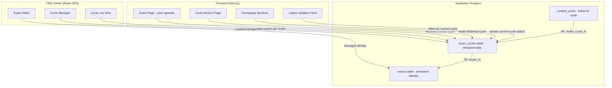
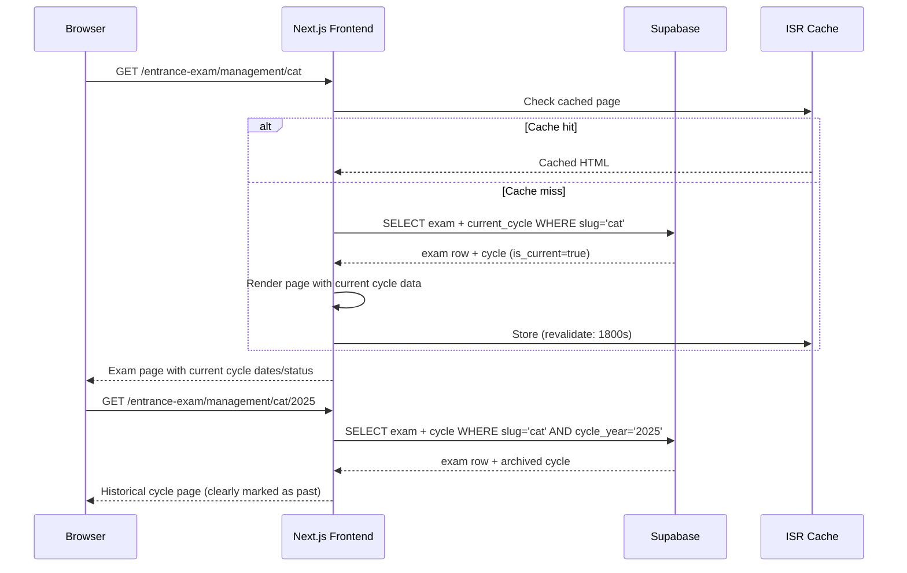
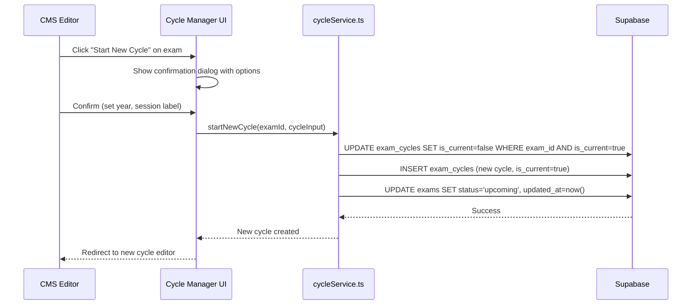

# Design Document: Exam Cycle Management

## Overview

This feature introduces a cycle management layer on top of the existing `exams` table, solving the core problem: exams like CAT, JEE, and NEET are conducted periodically, but each year's instance currently gets created as a new `exams` row (e.g., "cat-2025", "cat-2026"), leading to data duplication, broken SEO, and content confusion.

The design separates the **persistent exam identity** (CAT, the exam itself) from its **temporal cycles** (CAT 2025, CAT 2026, CAT 2027). Each exam retains a single canonical row in `exams`, while a new `exam_cycles` table tracks per-year/session metadata like dates, status, fees, and results. The frontend serves year-agnostic URLs (`/entrance-exam/management/cat`) that automatically resolve to the current cycle, with optional cycle-specific deep links (`/entrance-exam/management/cat/2025`) for historical data.

This operates entirely on the production `exams` table (127 rows, live on indianexaminfo.com). The ELMS entity system is explicitly out of scope — it has zero production usage and an unresolved decision pending (Track 2). The design is extensible to `sarkari-naukri` and `board-university` pillars but focuses on `entrance-exam` first.

## Architecture

### System Context



### Data Flow: Cycle Resolution



### CMS: Start New Cycle Flow



## Components and Interfaces

### Database Schema: `exam_cycles` Table

The central new table that holds per-cycle temporal data. The `exams` table retains all persistent identity fields (name, slug, pillar, category, conducting_body, entity_type, SEO, tags).

**What moves from `exams` to `exam_cycles`:**
- `status` — each cycle has its own lifecycle (upcoming → registration-open → active → completed)
- `important_dates` JSONB — dates are cycle-specific
- `eligibility` JSONB — can change between cycles (age limits, qualification requirements)
- `vacancy` — changes each cycle
- `application_fee` JSONB — fee structure may change
- `has_*` flags — content availability is cycle-specific (this cycle's admit card vs last cycle's)

**What stays on `exams`:**
- `slug`, `name`, `short_name` — permanent identity
- `pillar`, `category_id`, `subcategory_id` — classification
- `entity_type`, `conducting_body` — institutional
- `official_website` — rarely changes
- `seo_title`, `seo_description` — main page SEO (cycles get their own)
- `tags`, `search_keywords` — discovery
- `is_featured` — editorial prominence
- `selection_process`, `syllabus_highlights` — stable across cycles (usually)

### Interface: ExamCycle

```typescript
// src/types/examCycle.ts

export type CycleFrequency = 'annual' | 'biannual' | 'irregular';
export type CycleSession = 'main' | 'session-1' | 'session-2' | 'supplementary' | 'special';

export type CycleStatus =
  | 'upcoming'
  | 'registration-open'
  | 'registration-closed'
  | 'active'        // exam window open
  | 'result-declared'
  | 'completed';

export interface ExamCycle {
  id: string;
  examId: string;
  cycleYear: number;                    // 2025, 2026, etc.
  session: CycleSession;                // for biannual exams: session-1, session-2
  cycleLabel: string;                   // display: "2025", "2025 Session 1", "Jan 2026"
  status: CycleStatus;
  isCurrent: boolean;                   // exactly one per exam

  // Temporal data (moved from exams)
  importantDates: { label: string; date: string; isUrgent: boolean }[];
  eligibility: { age: string; qualification: string; nationality: string } | null;
  vacancy: number | null;
  applicationFee: { general: number; obc: number; sc: number; st: number; ews?: number } | null;

  // Content availability for THIS cycle
  hasAdmitCard: boolean;
  hasResult: boolean;
  hasAnswerKey: boolean;
  hasCutoff: boolean;
  hasApplication: boolean;
  hasNotification: boolean;

  // Cycle-specific SEO (optional override)
  seoTitle: string | null;
  seoDescription: string | null;

  // Results/cutoff data for completed cycles
  resultData: Record<string, unknown> | null;   // cutoff scores, pass percentages, etc.

  // Metadata
  startedAt: string;        // when this cycle was created/started
  completedAt: string | null;
  createdAt: string;
  updatedAt: string;
  createdBy: string | null;
}

// The exams table becomes the persistent identity
export interface ExamIdentity {
  id: string;
  slug: string;
  name: string;
  shortName: string;
  pillar: Pillar;
  category: string;
  subcategory: string;
  categoryId: string | null;
  subcategoryId: string | null;
  entityType: 'exam' | 'board' | 'university' | 'recruitment';
  conductingBody: string;
  officialWebsite: string;
  cycleFrequency: CycleFrequency;       // NEW: how often this exam runs

  // Stable content
  selectionProcess: string[];
  syllabusHighlights: string[];
  faqs: { question: string; answer: string }[];

  // Discovery & SEO
  tags: string[];
  searchKeywords: string[];
  seoTitle: string | null;
  seoDescription: string | null;
  isFeatured: boolean;
  isPublished: boolean;

  // Denormalized from current cycle for quick access
  currentCycleId: string | null;
  currentCycleStatus: CycleStatus | null;
  currentCycleYear: number | null;

  lastUpdated: string;
  createdAt: string;
  updatedAt: string;
}
```

## Data Models

### SQL Schema: `exam_cycles` Table

```sql
-- Cycle frequency enum
CREATE TYPE cycle_frequency AS ENUM ('annual', 'biannual', 'irregular');

-- Cycle session enum (for biannual/multi-session exams)
CREATE TYPE cycle_session AS ENUM ('main', 'session-1', 'session-2', 'supplementary', 'special');

-- New table: exam_cycles
CREATE TABLE exam_cycles (
  id               uuid PRIMARY KEY DEFAULT gen_random_uuid(),
  exam_id          uuid NOT NULL REFERENCES exams(id) ON DELETE CASCADE,
  cycle_year       integer NOT NULL,
  session          cycle_session NOT NULL DEFAULT 'main',
  cycle_label      text NOT NULL,           -- "2025", "2025 Session 1"
  status           exam_status NOT NULL DEFAULT 'upcoming',
  is_current       boolean NOT NULL DEFAULT false,

  -- Temporal data (cycle-specific)
  important_dates  jsonb NOT NULL DEFAULT '[]'::jsonb,
  eligibility      jsonb NOT NULL DEFAULT '{}'::jsonb,
  vacancy          integer,
  application_fee  jsonb NOT NULL DEFAULT '{}'::jsonb,

  -- Content availability flags for this cycle
  has_admit_card   boolean NOT NULL DEFAULT false,
  has_result       boolean NOT NULL DEFAULT false,
  has_answer_key   boolean NOT NULL DEFAULT false,
  has_cutoff       boolean NOT NULL DEFAULT false,
  has_application  boolean NOT NULL DEFAULT false,
  has_notification boolean NOT NULL DEFAULT false,

  -- Cycle-specific SEO (overrides exam-level when viewing this cycle)
  seo_title        text,
  seo_description  text,

  -- Archival data for completed cycles
  result_data      jsonb,                   -- cutoffs, pass rates, toppers, etc.

  -- Timestamps
  started_at       timestamptz NOT NULL DEFAULT now(),
  completed_at     timestamptz,
  created_at       timestamptz NOT NULL DEFAULT now(),
  updated_at       timestamptz NOT NULL DEFAULT now(),
  created_by       uuid REFERENCES auth.users(id) ON DELETE SET NULL
);

-- Exactly one current cycle per exam (partial unique index)
CREATE UNIQUE INDEX uq_exam_current_cycle
  ON exam_cycles(exam_id) WHERE is_current = true;

-- No duplicate year+session per exam
CREATE UNIQUE INDEX uq_exam_cycle_year_session
  ON exam_cycles(exam_id, cycle_year, session);

-- Performance indexes
CREATE INDEX idx_exam_cycles_exam_id ON exam_cycles(exam_id);
CREATE INDEX idx_exam_cycles_status ON exam_cycles(status);
CREATE INDEX idx_exam_cycles_is_current ON exam_cycles(is_current) WHERE is_current = true;
CREATE INDEX idx_exam_cycles_year ON exam_cycles(cycle_year DESC);

-- RLS
ALTER TABLE exam_cycles ENABLE ROW LEVEL SECURITY;

CREATE POLICY public_read_exam_cycles ON exam_cycles
  FOR SELECT TO anon, authenticated USING (true);

CREATE POLICY staff_write_exam_cycles ON exam_cycles
  FOR ALL TO authenticated
  USING (EXISTS (SELECT 1 FROM user_profiles WHERE id = auth.uid() AND role_id IN (
    SELECT id FROM roles WHERE slug IN ('admin', 'editor')
  )))
  WITH CHECK (EXISTS (SELECT 1 FROM user_profiles WHERE id = auth.uid() AND role_id IN (
    SELECT id FROM roles WHERE slug IN ('admin', 'editor')
  )));
```

### Schema Modifications to `exams` Table

```sql
-- Add cycle frequency to exams (persistent identity field)
ALTER TABLE exams ADD COLUMN cycle_frequency cycle_frequency NOT NULL DEFAULT 'annual';

-- Add denormalized current_cycle_id for fast lookups
ALTER TABLE exams ADD COLUMN current_cycle_id uuid REFERENCES exam_cycles(id) ON DELETE SET NULL;

-- Remove fields that are now cycle-specific (AFTER migration)
-- These will be kept temporarily during transition, marked deprecated
-- Phase 2: DROP COLUMN important_dates, eligibility, vacancy, application_fee,
--           has_admit_card, has_result, has_answer_key, has_cutoff,
--           has_application, has_notification, status
-- (status stays on exams as a "master" status: 'active'|'inactive'|'deprecated')
```

### Schema Modifications to `content_posts` Table

```sql
-- Link content posts to a specific cycle (optional — null means exam-level content)
ALTER TABLE content_posts ADD COLUMN exam_cycle_id uuid REFERENCES exam_cycles(id) ON DELETE SET NULL;

-- Index for cycle-based content queries
CREATE INDEX idx_content_posts_cycle ON content_posts(exam_cycle_id) WHERE exam_cycle_id IS NOT NULL;
```

### Trigger: Maintain `is_current` Invariant

```sql
-- Ensure only one current cycle per exam (belt + suspenders with the partial unique index)
CREATE OR REPLACE FUNCTION maintain_current_cycle()
RETURNS TRIGGER AS $$
BEGIN
  IF NEW.is_current = true THEN
    -- Deactivate any other current cycle for this exam
    UPDATE exam_cycles
    SET is_current = false, updated_at = now()
    WHERE exam_id = NEW.exam_id
      AND id != NEW.id
      AND is_current = true;

    -- Update the denormalized pointer on exams
    UPDATE exams
    SET current_cycle_id = NEW.id, updated_at = now()
    WHERE id = NEW.exam_id;
  END IF;

  -- If we just un-set current and nothing else is current, null out the pointer
  IF NEW.is_current = false AND OLD.is_current = true THEN
    UPDATE exams
    SET current_cycle_id = NULL, updated_at = now()
    WHERE id = NEW.exam_id
      AND NOT EXISTS (
        SELECT 1 FROM exam_cycles
        WHERE exam_id = NEW.exam_id AND is_current = true AND id != NEW.id
      );
  END IF;

  RETURN NEW;
END;
$$ LANGUAGE plpgsql;

CREATE TRIGGER trg_maintain_current_cycle
  AFTER INSERT OR UPDATE OF is_current ON exam_cycles
  FOR EACH ROW EXECUTE FUNCTION maintain_current_cycle();
```

## Algorithmic Pseudocode

### Algorithm: Start New Cycle

```typescript
async function startNewCycle(
  examId: string,
  input: { cycleYear: number; session: CycleSession; cycleLabel: string }
): Promise<ExamCycle> {
  // PRECONDITION: examId exists in exams table
  // PRECONDITION: no cycle exists for this exam+year+session combination
  // POSTCONDITION: exactly one cycle with is_current=true for this exam
  // POSTCONDITION: previous current cycle has is_current=false

  const { data: existing } = await supabase
    .from('exam_cycles')
    .select('id')
    .eq('exam_id', examId)
    .eq('cycle_year', input.cycleYear)
    .eq('session', input.session)
    .maybeSingle();

  if (existing) {
    throw new Error(`Cycle ${input.cycleLabel} already exists for this exam`);
  }

  // The trigger handles deactivating the old current cycle
  const { data: newCycle, error } = await supabase
    .from('exam_cycles')
    .insert({
      exam_id: examId,
      cycle_year: input.cycleYear,
      session: input.session,
      cycle_label: input.cycleLabel,
      status: 'upcoming',
      is_current: true,
      important_dates: [],
      eligibility: {},
      application_fee: {},
    })
    .select()
    .single();

  if (error) throw error;
  return mapCycleRow(newCycle);
}
```

### Algorithm: Resolve Current Cycle for Frontend

```typescript
async function getExamWithCurrentCycle(
  slug: string,
  category?: string
): Promise<{ exam: ExamIdentity; cycle: ExamCycle | null }> {
  // PRECONDITION: slug is a valid exam slug
  // POSTCONDITION: returns exam identity + at most one current cycle
  // POSTCONDITION: if no current cycle exists, cycle is null (exam has no active cycle)

  const supabase = createServerClient();
  let query = supabase
    .from('exams')
    .select(`
      *,
      cat:categories!category_id(slug),
      subcat:categories!subcategory_id(slug),
      current_cycle:exam_cycles!current_cycle_id(*)
    `)
    .eq('slug', slug);

  if (category) {
    const { data: catData } = await supabase
      .from('categories')
      .select('id')
      .eq('slug', category)
      .single();
    if (catData) query = query.eq('category_id', catData.id);
  }

  const { data, error } = await query.maybeSingle();
  if (error || !data) return { exam: null, cycle: null };

  return {
    exam: mapExamIdentityRow(data),
    cycle: data.current_cycle ? mapCycleRow(data.current_cycle) : null,
  };
}
```

### Algorithm: Get Historical Cycle

```typescript
async function getExamCycleByYear(
  slug: string,
  cycleYear: number,
  session: CycleSession = 'main'
): Promise<{ exam: ExamIdentity; cycle: ExamCycle | null }> {
  // PRECONDITION: slug is a valid exam slug
  // POSTCONDITION: returns the specific cycle for the given year/session, or null

  const supabase = createServerClient();
  const { data: exam } = await supabase
    .from('exams')
    .select('id, *')
    .eq('slug', slug)
    .single();

  if (!exam) return { exam: null, cycle: null };

  const { data: cycle } = await supabase
    .from('exam_cycles')
    .select('*')
    .eq('exam_id', exam.id)
    .eq('cycle_year', cycleYear)
    .eq('session', session)
    .maybeSingle();

  return {
    exam: mapExamIdentityRow(exam),
    cycle: cycle ? mapCycleRow(cycle) : null,
  };
}
```

### Algorithm: Migrate Existing Exam Data to Cycles

```typescript
async function migrateExamToCycles(examId: string): Promise<void> {
  // PRECONDITION: exam exists with temporal data in legacy columns
  // POSTCONDITION: one exam_cycle row created with is_current=true
  // POSTCONDITION: legacy temporal columns preserved (not deleted) for rollback safety
  // INVARIANT: migration is idempotent — running twice produces same result

  const { data: exam } = await supabase
    .from('exams')
    .select('*')
    .eq('id', examId)
    .single();

  if (!exam) throw new Error('Exam not found');

  // Skip if already migrated
  const { data: existingCycles } = await supabase
    .from('exam_cycles')
    .select('id')
    .eq('exam_id', examId);

  if (existingCycles && existingCycles.length > 0) return; // idempotent

  // Infer cycle year from slug, name, or dates
  const cycleYear = inferCycleYear(exam);

  await supabase.from('exam_cycles').insert({
    exam_id: examId,
    cycle_year: cycleYear,
    session: 'main',
    cycle_label: String(cycleYear),
    status: exam.status,
    is_current: true,
    important_dates: exam.important_dates ?? [],
    eligibility: exam.eligibility ?? {},
    vacancy: exam.vacancy,
    application_fee: exam.application_fee ?? {},
    has_admit_card: exam.has_admit_card,
    has_result: exam.has_result,
    has_answer_key: exam.has_answer_key,
    has_cutoff: exam.has_cutoff,
    has_application: exam.has_application,
    has_notification: exam.has_notification,
  });
}

function inferCycleYear(exam: Record<string, unknown>): number {
  // Strategy 1: Extract year from slug (e.g., "cat-2026" → 2026)
  const slugMatch = (exam.slug as string)?.match(/(\d{4})/);
  if (slugMatch) return parseInt(slugMatch[1]);

  // Strategy 2: Extract year from name
  const nameMatch = (exam.name as string)?.match(/(\d{4})/);
  if (nameMatch) return parseInt(nameMatch[1]);

  // Strategy 3: Use most recent date from important_dates
  const dates = (exam.important_dates as Array<{ date: string }>) ?? [];
  if (dates.length > 0) {
    const years = dates
      .map(d => new Date(d.date).getFullYear())
      .filter(y => y > 2020 && y < 2030);
    if (years.length > 0) return Math.max(...years);
  }

  // Strategy 4: Default to current year
  return new Date().getFullYear();
}
```

## Key Functions with Formal Specifications

### CMS Service: `cycleService.ts`

```typescript
// src/services/cycleService.ts

export async function listCycles(examId: string): Promise<ExamCycle[]>
// Precondition: examId is a valid UUID referencing an existing exam
// Postcondition: returns all cycles for the exam, ordered by cycle_year DESC, session
// Postcondition: result.length >= 0

export async function getCurrentCycle(examId: string): Promise<ExamCycle | null>
// Precondition: examId is a valid UUID
// Postcondition: returns the cycle with is_current=true, or null if none exists
// Postcondition: at most one result (enforced by partial unique index)

export async function startNewCycle(examId: string, input: StartCycleInput): Promise<ExamCycle>
// Precondition: examId exists, input.cycleYear > 2000, no duplicate year+session
// Postcondition: new cycle exists with is_current=true
// Postcondition: all previous cycles for this exam have is_current=false
// Side effect: updates exams.current_cycle_id via trigger

export async function updateCycle(cycleId: string, updates: Partial<ExamCycle>): Promise<ExamCycle>
// Precondition: cycleId exists
// Postcondition: cycle updated with new values
// Constraint: cannot change exam_id or id
// Constraint: cannot set is_current=false without setting another cycle as current

export async function completeCycle(cycleId: string, resultData?: Record<string, unknown>): Promise<ExamCycle>
// Precondition: cycleId exists, cycle.status != 'completed'
// Postcondition: cycle.status = 'completed', cycle.completed_at = now()
// Postcondition: result_data stored if provided
// Note: does NOT automatically start a new cycle — that's a separate editorial action

export async function archiveCycles(examId: string): Promise<ExamCycle[]>
// Precondition: examId exists
// Postcondition: returns all non-current cycles ordered by year DESC
// Use case: CMS cycle history view, frontend archive pages
```

### Frontend Service: `examService.ts` (modified)

```typescript
// Changes to indianexaminfo-frontend/services/examService.ts

export async function getExamBySlug(slug: string, category?: string): Promise<ExamWithCycle | null>
// Precondition: slug is non-empty string
// Postcondition: returns exam identity merged with current cycle data
// Postcondition: backward-compatible ExamEntity shape for existing components
// Migration path: during transition, falls back to legacy columns if no cycle exists

export async function getExamCycleHistory(examId: string): Promise<ExamCycle[]>
// Precondition: examId is valid
// Postcondition: returns all cycles ordered newest-first
// Use case: "Previous Years" section on exam page

export async function getExamsByPillarWithCycles(pillar: Pillar): Promise<ExamWithCycle[]>
// Precondition: pillar is valid enum value
// Postcondition: returns exams joined with their current cycle
// Postcondition: exams without a current cycle still appear (cycle fields null)
```

## Example Usage

### CMS: Starting a New Cycle

```typescript
// Editor clicks "Start New Cycle" for CAT exam
const catExamId = 'abc-123-...';

// Check what cycles already exist
const existingCycles = await listCycles(catExamId);
// → [{ cycleYear: 2025, status: 'completed', isCurrent: false }]

// Start new cycle
const newCycle = await startNewCycle(catExamId, {
  cycleYear: 2026,
  session: 'main',
  cycleLabel: '2026',
});
// → { id: 'xyz-...', cycleYear: 2026, status: 'upcoming', isCurrent: true }

// Editor fills in dates for the new cycle
await updateCycle(newCycle.id, {
  importantDates: [
    { label: 'Registration Opens', date: '2025-08-01', isUrgent: false },
    { label: 'Registration Closes', date: '2025-09-15', isUrgent: true },
    { label: 'Exam Date', date: '2025-11-24', isUrgent: true },
  ],
  status: 'upcoming',
});
```

### CMS: Biannual Exam (CUET with two sessions)

```typescript
// CUET has two sessions per year
const cuetId = 'def-456-...';

await startNewCycle(cuetId, {
  cycleYear: 2026,
  session: 'session-1',
  cycleLabel: '2026 Session 1',
});

// Later, when session 2 approaches:
await startNewCycle(cuetId, {
  cycleYear: 2026,
  session: 'session-2',
  cycleLabel: '2026 Session 2',
});
// This automatically makes session-2 current, session-1 becomes historical
```

### Frontend: Year-Agnostic URL Resolution

```typescript
// app/[pillar]/[category]/[slug]/page.tsx
export default async function ExamPage({ params }) {
  const { slug, category } = params;

  // Automatically resolves to current cycle
  const { exam, cycle } = await getExamWithCurrentCycle(slug, category);

  if (!exam) return notFound();

  // cycle may be null if exam has no active cycle (rare edge case)
  return (
    <ExamPageLayout exam={exam} cycle={cycle}>
      <ExamDates dates={cycle?.importantDates ?? []} />
      <ExamEligibility eligibility={cycle?.eligibility} />
      <ExamFees fees={cycle?.applicationFee} />
      <CycleHistoryLink examId={exam.id} />
    </ExamPageLayout>
  );
}

// app/[pillar]/[category]/[slug]/[year]/page.tsx
export default async function CycleArchivePage({ params }) {
  const { slug, year } = params;
  const cycleYear = parseInt(year);

  const { exam, cycle } = await getExamCycleByYear(slug, cycleYear);

  if (!exam || !cycle) return notFound();

  return (
    <ExamPageLayout exam={exam} cycle={cycle} isArchive>
      <ArchiveBanner year={cycleYear} currentYear={new Date().getFullYear()} />
      <ExamDates dates={cycle.importantDates} />
      {cycle.resultData && <CycleResults data={cycle.resultData} />}
    </ExamPageLayout>
  );
}
```

### Frontend: Homepage Shows Current Cycle Only

```typescript
// components/homepage/EntranceExamSection.tsx (modified)
export async function EntranceExamSection() {
  // This query now joins with exam_cycles to get current status
  const exams = await getExamsByPillarWithCycles('entrance-exam');

  // Only show exams that have an active current cycle
  const activeExams = exams.filter(e => e.cycle && e.cycle.status !== 'completed');

  return <EntranceExamClient exams={activeExams} />;
}
```

## Correctness Properties

### Property 1: Single Current Cycle Invariant
∀ exam_id ∈ exams: |{c ∈ exam_cycles | c.exam_id = exam_id ∧ c.is_current = true}| ≤ 1

Enforced by: partial unique index `uq_exam_current_cycle` + trigger `trg_maintain_current_cycle`. The index provides hard database-level enforcement. The trigger provides the automatic deactivation behavior so the application doesn't need two-step updates.

### Property 2: Cycle Year + Session Uniqueness
∀ exam_id, year, session: |{c ∈ exam_cycles | c.exam_id = exam_id ∧ c.cycle_year = year ∧ c.session = session}| ≤ 1

Enforced by: unique index `uq_exam_cycle_year_session`. Prevents accidentally creating duplicate cycles for the same year/session through race conditions or repeated form submissions.

### Property 3: Current Cycle Pointer Consistency
∀ exam ∈ exams: exam.current_cycle_id IS NULL ↔ ¬∃ c ∈ exam_cycles(c.exam_id = exam.id ∧ c.is_current = true)

The denormalized `exams.current_cycle_id` always points to the cycle with `is_current=true` for that exam, or is NULL if no current cycle exists. Maintained by the trigger.

### Property 4: Temporal Ordering
∀ exam_id: cycles ordered by (cycle_year DESC, session) form a valid timeline. A cycle with `completed_at IS NOT NULL` must have `cycle_year ≤ current_cycle.cycle_year` (you cannot complete a future cycle before the current one).

Enforced by: application logic in `completeCycle()` — the function checks that the cycle being completed is indeed the current cycle or an older one.

### Property 5: Migration Idempotency
Running `migrateExamToCycles(examId)` on an exam that already has cycles is a no-op. The function checks for existing cycles before inserting. This allows safe re-runs of the batch migration.

### Property 6: Frontend Backward Compatibility
During the transition period, `getExamBySlug()` returns an `ExamEntity`-compatible shape regardless of whether the exam has been migrated to cycles. If `current_cycle_id` is null, it falls back to reading legacy columns directly from the `exams` row.

### Property 7: Content Post Linkage
∀ content_post with exam_cycle_id ≠ NULL: content_post.exam_id = exam_cycles[exam_cycle_id].exam_id

A content post linked to a cycle must also be linked to that cycle's parent exam. The application enforces this on insert; the database does not have a composite FK (intentional — allows the exam_id FK to be set before the cycle is chosen).

## Error Handling

### Scenario 1: Start New Cycle — Duplicate Year/Session

**Condition**: Editor tries to create a cycle for a year+session that already exists.
**Response**: Application-level check before insert shows inline error: "A cycle for CAT 2026 (Main) already exists. View existing cycle?" with a link.
**Recovery**: Editor can navigate to the existing cycle, or choose a different session.
**Database safety net**: `uq_exam_cycle_year_session` index rejects the insert if the app check races.

### Scenario 2: Concurrent Cycle Creation (Race Condition)

**Condition**: Two editors simultaneously create the same cycle.
**Response**: The unique index causes one INSERT to fail with a `23505` (unique_violation) error.
**Recovery**: The losing editor sees a toast: "This cycle was just created by another editor. Refreshing..." followed by an automatic page reload.

### Scenario 3: Start New Cycle — Exam Has No Previous Cycles

**Condition**: Editor starts a cycle on a freshly-created exam (or one not yet migrated).
**Response**: Works normally — the new cycle becomes the first and current cycle. No deactivation needed.
**Recovery**: N/A (happy path).

### Scenario 4: Frontend — Exam With No Current Cycle

**Condition**: An exam exists but has no cycle with `is_current=true` (all completed, none started).
**Response**: Frontend renders the exam page with identity info but shows "Next cycle details coming soon" in place of dates/status. Falls back to legacy columns during transition period.
**Recovery**: Editor creates a new cycle via CMS.

### Scenario 5: Migration — Ambiguous Cycle Year Inference

**Condition**: `inferCycleYear()` cannot determine the year from slug, name, or dates.
**Response**: Defaults to current year. Logs the exam to a migration report for manual review.
**Recovery**: Editor can manually adjust the cycle year after migration.

### Scenario 6: Complete Cycle — Result Data Validation

**Condition**: Editor marks a cycle complete but provides malformed result data.
**Response**: Zod schema validates `resultData` shape. Rejects with inline field errors.
**Recovery**: Editor corrects the data and resubmits.

## Testing Strategy

### Unit Testing Approach

**Test framework**: Vitest (already configured in the project)

Key unit tests:
- `inferCycleYear()`: test with various slug formats ("cat-2026", "mba-cat-2026", "cat"), name formats, date arrays, and edge cases (no year found)
- `mapCycleRow()`: verify snake_case → camelCase mapping for all fields
- `mapExamIdentityRow()`: verify backward-compatible field extraction
- Zod schemas for `StartCycleInput`, `UpdateCycleInput`, `ResultData`
- `buildCycleLabel()`: verify label generation for annual vs biannual exams

### Property-Based Testing Approach

**Library**: fast-check

```typescript
import fc from 'fast-check';

// Property: inferCycleYear always returns a valid year
fc.assert(
  fc.property(
    fc.record({
      slug: fc.string(),
      name: fc.string(),
      important_dates: fc.array(fc.record({ date: fc.date().map(d => d.toISOString()) }))
    }),
    (exam) => {
      const year = inferCycleYear(exam);
      return year >= 2020 && year <= 2100;
    }
  )
);

// Property: startNewCycle followed by getCurrentCycle returns that cycle
// Property: two startNewCycle calls result in only the second being current
// Property: cycle year+session uniqueness constraint prevents duplicates
```

### Integration Testing Approach

- Migration script against a test database seeded with real-world exam data patterns
- Verify `trg_maintain_current_cycle` fires correctly on INSERT/UPDATE
- Verify partial unique index rejects duplicate current cycles
- Frontend `getExamWithCurrentCycle` returns correct cycle after cycle rotation
- Content posts with `exam_cycle_id` join correctly through the cycle to the exam

## Performance Considerations

1. **Denormalized `current_cycle_id`**: Avoids a subquery/join on every frontend page load. The partial index on `is_current` makes the alternative (filtering exam_cycles) fast too, but having it on `exams` means the most common query pattern (`SELECT exam + current_cycle`) is a single FK join rather than a filtered scan.

2. **Partial index on `is_current`**: Only indexes rows where `is_current = true` (at most one per exam), making the index tiny and fast regardless of how many historical cycles accumulate.

3. **Frontend caching**: ISR with 30-minute revalidation (same as current). Cycle changes are editorial events that happen at most a few times per year per exam — eventual consistency is perfectly acceptable.

4. **Homepage query optimization**: The homepage `EntranceExamSection` joins exams with their current cycle. Adding `current_cycle_id` to the `exams` table means this is a simple FK join, not a subquery. With 127 exams, even an unoptimized version would be fast, but this scales to thousands.

5. **Archive pages**: Historical cycle data is cold — accessed rarely. No special caching or indexing beyond the compound unique index on `(exam_id, cycle_year, session)`.

## Security Considerations

1. **RLS on `exam_cycles`**: Public read (anon + authenticated) for frontend consumption. Write restricted to admin/editor roles — same pattern as `exams` table.

2. **Cycle creation authorization**: Only admin and editor roles can start/complete/modify cycles. Enforced at the database level via RLS policies, not just the application.

3. **No cascading deletes from exam to cycles in production**: While the FK has `ON DELETE CASCADE`, deleting an exam is already an admin-only action behind a confirmation dialog. The cascade is intentional — if an exam is deleted, its cycles should go with it.

4. **Audit trail**: All cycle mutations should trigger the existing `audit_log` table via the pattern already established in the CMS (manual audit log calls in service functions).

## Dependencies

### External Dependencies
- **Supabase Postgres** — all schema changes via migrations
- **TanStack Query** — cache invalidation on cycle mutations (already in use)
- **Zod** — validation schemas for cycle input (already in use)
- **date-fns** — date formatting for cycle labels and archive displays (already in use)

### Internal Dependencies
- **`exams` table** — the parent table for cycles. Must exist with current schema.
- **`content_posts` table** — receives the new `exam_cycle_id` FK column.
- **`examService.ts` (frontend)** — must be updated to join with cycles.
- **`examService.ts` (CMS)** — must be updated to delegate temporal data to cycles.
- **Exam editor UI** — needs a Cycle Manager tab/panel for creating and switching cycles.

### Relationship to Other Specs
- **exam-data-deduplication**: That spec operates on the ELMS entity system. This spec operates on the production `exams` table. They are complementary but independent — if the ELMS system is eventually adopted (Track 2 decision), cycles would need to be ported or the concept integrated there.
- **legacy-exam-migration**: If that spec proceeds with "entity canonical" (Option A), this cycle management feature would need to be re-evaluated. If it proceeds with "keep exams" (Option B or any variation), this feature enhances the `exams` table directly and is fully compatible.

## Migration Strategy

### Phase 1: Schema Addition (non-breaking)

1. Create `cycle_frequency` and `cycle_session` enums
2. Create `exam_cycles` table with all indexes and RLS
3. Add `cycle_frequency` and `current_cycle_id` columns to `exams`
4. Add `exam_cycle_id` column to `content_posts`
5. Create the `maintain_current_cycle` trigger

**No existing functionality is affected.** The frontend continues reading from `exams` directly. New columns have defaults or are nullable.

### Phase 2: Data Migration (one-time batch)

1. For each exam in `exams`, run `migrateExamToCycles()`:
   - Infer cycle year from slug/name/dates
   - Create one `exam_cycles` row with `is_current=true`
   - Copy temporal data (important_dates, eligibility, vacancy, application_fee, has_* flags, status)
   - Set `exams.current_cycle_id` to the new cycle
2. Set `exams.cycle_frequency` based on known exam patterns (curated mapping for major exams, default 'annual')
3. Link existing `content_posts` to their appropriate cycle via `exam_cycle_id`

**Dry-run support**: Migration script produces a report before committing, showing inferred years and any ambiguous cases.

### Phase 3: CMS Integration

1. Add Cycle Manager UI to the exam editor (new tab or section)
2. Modify exam creation flow: creating an exam also creates its first cycle
3. Update exam list view to show current cycle status
4. Add "Start New Cycle" action to exam list and detail pages

### Phase 4: Frontend Integration

1. Update `getExamBySlug()` to join with `exam_cycles` via `current_cycle_id`
2. Implement backward-compatible response: merge cycle data into the ExamEntity shape
3. Add `[year]` route for archive pages
4. Update homepage sections to filter by current cycle status
5. Update "Latest Updates" feed to scope to current cycles

### Phase 5: Cleanup (post-validation)

1. Mark legacy temporal columns on `exams` as deprecated (add COMMENTs)
2. Update all CMS writes to target `exam_cycles` instead of `exams` for temporal data
3. (Future) Drop deprecated columns from `exams` once all reads are migrated

## Extensibility to Other Pillars

### sarkari-naukri
Recruitment notifications also follow cycles (e.g., SSC CGL 2025, SSC CGL 2026). The `exam_cycles` table and the `cycle_frequency` concept apply directly. The `sarkari_naukri` table would either:
- Get its own `sarkari_naukri_cycles` table (if it remains separate), or
- Migrate into `exams` + `exam_cycles` (if recruitment entities are unified under one table)

### board-university
Board exams (10th, 12th) and university exams have clear annual cycles. The same model applies with `cycle_frequency = 'annual'` and `session` used for supplementary exams.

### Design Decision: Why `exam_cycles` not `entity_cycles`
The table is named `exam_cycles` (not `entity_cycles`) because it operates on the production `exams` table. If the Track 2 decision resolves to adopt the entity system, a rename or new table would be part of that migration — but designing for a system that might never be adopted would be premature.

