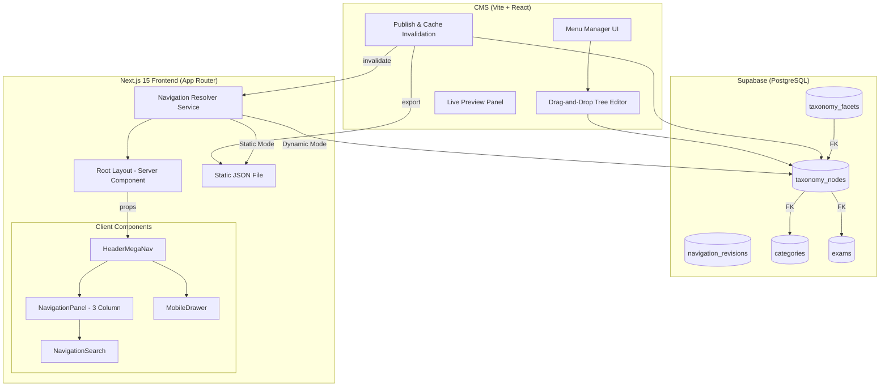
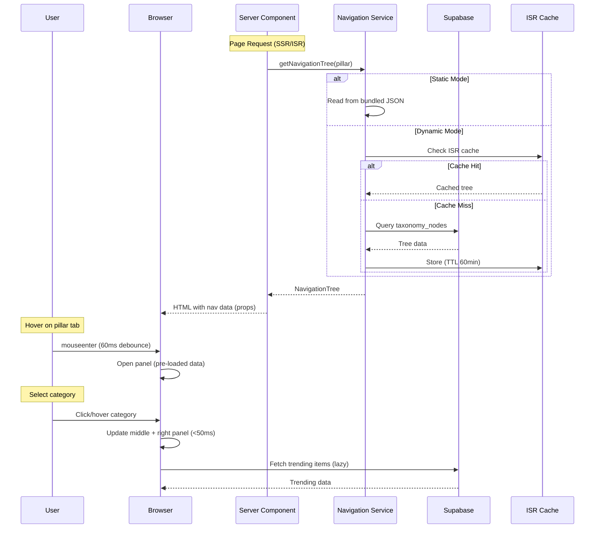
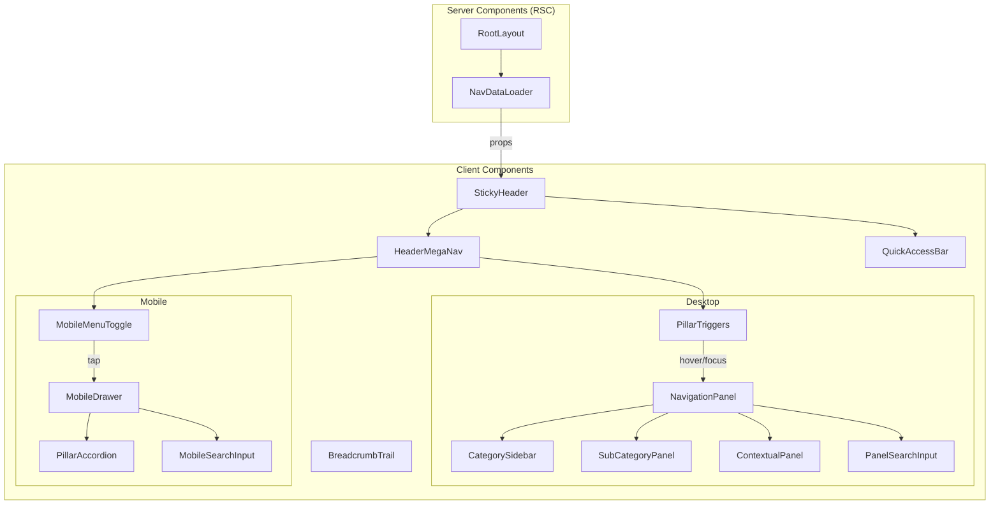

# Design Document: Navigation Mega Menu Redesign

## Overview

This design transforms IndianExamInfo's navigation from a 3-pillar static system into a scalable 6-domain navigation architecture with CMS-driven management. The system supports both static (build-time JSON) and dynamic (Supabase ISR) modes, a modern 3-column mega menu inspired by Notion/Stripe/Linear, full accessibility compliance, and a CMS drag-and-drop menu builder.

### Key Design Decisions

1. **Taxonomy Table over Categories Enhancement**: Rather than extending the existing `categories` table (which has FK constraints from `exams`), we introduce a dedicated `taxonomy_nodes` table that represents the full navigation hierarchy. The existing `categories` table continues to serve exam grouping, and taxonomy nodes can reference categories/exams via foreign keys.

2. **Adjacency List with Materialized Path**: The taxonomy tree uses adjacency list (`parent_id`) for writes and a materialized `path` column (e.g., `government-exam/ssc/ssc-cgl`) for fast ancestor/descendant queries and breadcrumb generation.

3. **Dual-Mode Architecture**: A `NAVIGATION_MODE` environment variable switches between static JSON and Supabase ISR. Both modes share identical TypeScript interfaces, ensuring rendering parity.

4. **Server Components for Initial Render**: Navigation data is resolved in Next.js Server Components (RSC) and passed as props to client interactive components. No client-side fetching on initial load.

5. **Progressive Enhancement on Hover**: Right panel content (trending, recently updated) loads lazily only when a category is selected, keeping initial payload minimal.

6. **Pillar Type Expansion**: The existing `Pillar` type expands from 3 values to 6: `government-exam`, `government-jobs`, `entrance-exam`, `university-exam`, `board-exam`, `news`. A database migration adds these as enum values.

---

## Architecture



### Data Flow



---

## Components and Interfaces

### TypeScript Types (Shared)

```typescript
// types/navigation.ts

export type Pillar = 
  | "government-exam" 
  | "government-jobs" 
  | "entrance-exam" 
  | "university-exam" 
  | "board-exam" 
  | "news";

export type BadgeType = "popular" | "new" | "updated" | "trending" | "urgent" | null;

export type DiscoveryFacet = 
  | "state" | "qualification" | "stream" | "degree" 
  | "department" | "organisation" | "university" 
  | "board" | "course" | "selection-process" 
  | "admission-mode" | "exam-mode" | "frequency" | "status";

export interface TaxonomyNode {
  id: string;
  slug: string;
  label: string;
  pillar: Pillar;
  parentId: string | null;
  path: string; // materialized path: "government-exam/ssc/ssc-cgl"
  depth: number;
  displayOrder: number;
  isActive: boolean;
  isPinned: boolean;
  icon: string | null;
  badge: BadgeType;
  description: string | null;
  itemCount: number;
  
  // SEO
  seoTitle: string | null;
  seoDescription: string | null;
  ogImage: string | null;
  
  // References
  categoryId: string | null; // FK to existing categories table
  examId: string | null; // FK to existing exams table
  
  // Navigation display
  maxItems: number;
  showItemCount: boolean;
  featuredItemIds: string[];
  customUrl: string | null; // override auto-generated URL
  
  // Metadata
  createdAt: string;
  updatedAt: string;
  
  // Computed (from tree resolution)
  children?: TaxonomyNode[];
}

export interface NavigationTree {
  pillar: Pillar;
  label: string;
  href: string;
  nodes: TaxonomyNode[];
  totalItemCount: number;
  lastUpdated: string;
}

export interface TaxonomyFacetValue {
  nodeId: string;
  facet: DiscoveryFacet;
  value: string;
  slug: string;
}

export interface NavigationPanelData {
  categories: TaxonomyNode[]; // depth=1 children (left sidebar)
  subCategories: TaxonomyNode[]; // depth=2 children of selected category (middle panel)
  contextual: ContextualPanelData; // right panel
}

export interface ContextualPanelData {
  featured: NavigationItem[];
  trending: NavigationItem[];
  recentlyUpdated: NavigationItem[];
  latestUpdates: NotificationItem[];
}

export interface NavigationItem {
  id: string;
  slug: string;
  label: string;
  shortLabel: string;
  href: string;
  badge: BadgeType;
  icon: string | null;
  metadata?: Record<string, string>; // e.g., { deadline: "2025-02-15", vacancies: "500" }
}

export interface NotificationItem {
  id: string;
  title: string;
  href: string;
  timestamp: string;
  type: "result" | "notification" | "deadline" | "news";
}

// Navigation mode configuration
export interface NavigationConfig {
  mode: "static" | "dynamic";
  revalidateInterval: number; // seconds (default 3600)
  staticDataPath: string; // path to JSON file
  pillars: PillarConfig[];
}

export interface PillarConfig {
  pillar: Pillar;
  label: string;
  href: string;
  isEnabled: boolean;
}
```

### Component Architecture



### Key Component Props

```typescript
// HeaderMegaNav (client)
interface HeaderMegaNavProps {
  pillars: NavigationTree[];
  quickAccessItems: QuickAccessItem[];
}

// NavigationPanel (client) — 3-column desktop mega menu
interface NavigationPanelProps {
  tree: NavigationTree;
  onClose: () => void;
  onPanelMouseEnter: () => void;
  onPanelMouseLeave: () => void;
}

// CategorySidebar (client) — left column
interface CategorySidebarProps {
  categories: TaxonomyNode[];
  selectedId: string | null;
  onSelect: (node: TaxonomyNode) => void;
  pinnedIds: string[];
}

// SubCategoryPanel (client) — middle column
interface SubCategoryPanelProps {
  parentNode: TaxonomyNode;
  subCategories: TaxonomyNode[];
  pillar: Pillar;
}

// ContextualPanel (client) — right column
interface ContextualPanelProps {
  data: ContextualPanelData;
  pillar: Pillar;
  isLoading: boolean;
}

// MobileDrawer (client)
interface MobileDrawerProps {
  pillars: NavigationTree[];
  quickAccessItems: QuickAccessItem[];
  onClose: () => void;
}

// BreadcrumbTrail (server)
interface BreadcrumbTrailProps {
  path: string; // materialized path from taxonomy_nodes
  pillar: Pillar;
}
```

### Navigation Service API

```typescript
// services/navigationService.ts (enhanced)

// Server-side: full tree (ISR cached)
export async function getNavigationTree(pillar: Pillar): Promise<NavigationTree>;

// Server-side: all pillars for header render
export async function getAllNavigationTrees(): Promise<NavigationTree[]>;

// Server-side: breadcrumb resolution
export async function resolveBreadcrumb(path: string): Promise<BreadcrumbItem[]>;

// Client-side: contextual panel data (lazy loaded)
export async function getContextualData(
  nodeId: string, 
  pillar: Pillar
): Promise<ContextualPanelData>;

// Client-side: navigation search
export async function searchNavigation(
  query: string, 
  pillar: Pillar | null, // null = search all
  limit?: number
): Promise<NavigationSearchResult[]>;

// Static mode: read from JSON
export async function getStaticNavigationTree(pillar: Pillar): Promise<NavigationTree>;

// CMS: export navigation to static JSON
export async function exportNavigationToStatic(): Promise<void>;
```

---

## Data Models

### Database Schema

```sql
-- Expand the pillar enum
ALTER TYPE pillar_enum ADD VALUE IF NOT EXISTS 'government-exam';
ALTER TYPE pillar_enum ADD VALUE IF NOT EXISTS 'government-jobs';
ALTER TYPE pillar_enum ADD VALUE IF NOT EXISTS 'university-exam';
ALTER TYPE pillar_enum ADD VALUE IF NOT EXISTS 'news';

-- Core taxonomy table
CREATE TABLE taxonomy_nodes (
  id UUID PRIMARY KEY DEFAULT gen_random_uuid(),
  slug TEXT NOT NULL,
  label TEXT NOT NULL,
  pillar pillar_enum NOT NULL,
  parent_id UUID REFERENCES taxonomy_nodes(id) ON DELETE CASCADE,
  path TEXT NOT NULL, -- materialized path: "government-exam/ssc/ssc-cgl"
  depth INTEGER NOT NULL DEFAULT 0,
  display_order INTEGER NOT NULL DEFAULT 0,
  is_active BOOLEAN NOT NULL DEFAULT true,
  is_pinned BOOLEAN NOT NULL DEFAULT false,
  
  -- Display
  icon TEXT,
  badge TEXT CHECK (badge IN ('popular', 'new', 'updated', 'trending', 'urgent')),
  description TEXT,
  item_count INTEGER NOT NULL DEFAULT 0,
  
  -- SEO
  seo_title TEXT,
  seo_description TEXT,
  og_image TEXT,
  
  -- References to existing data
  category_id UUID REFERENCES categories(id),
  exam_id UUID REFERENCES exams(id),
  
  -- Navigation config
  max_items INTEGER NOT NULL DEFAULT 15,
  show_item_count BOOLEAN NOT NULL DEFAULT true,
  featured_item_ids UUID[] DEFAULT '{}',
  custom_url TEXT,
  
  -- Timestamps
  created_at TIMESTAMPTZ NOT NULL DEFAULT now(),
  updated_at TIMESTAMPTZ NOT NULL DEFAULT now(),
  
  -- Constraints
  UNIQUE (pillar, slug, parent_id),
  CONSTRAINT valid_depth CHECK (depth >= 0 AND depth <= 5)
);

-- Indexes for performance
CREATE INDEX idx_taxonomy_pillar_active ON taxonomy_nodes(pillar, is_active) WHERE is_active = true;
CREATE INDEX idx_taxonomy_parent ON taxonomy_nodes(parent_id);
CREATE INDEX idx_taxonomy_path ON taxonomy_nodes USING gin (path gin_trgm_ops);
CREATE INDEX idx_taxonomy_depth_order ON taxonomy_nodes(pillar, depth, display_order);

-- Discovery facets (many-to-many)
CREATE TABLE taxonomy_facets (
  id UUID PRIMARY KEY DEFAULT gen_random_uuid(),
  node_id UUID NOT NULL REFERENCES taxonomy_nodes(id) ON DELETE CASCADE,
  facet TEXT NOT NULL CHECK (facet IN (
    'state', 'qualification', 'stream', 'degree', 'department',
    'organisation', 'university', 'board', 'course',
    'selection-process', 'admission-mode', 'exam-mode', 'frequency', 'status'
  )),
  value TEXT NOT NULL,
  slug TEXT NOT NULL,
  display_order INTEGER NOT NULL DEFAULT 0,
  created_at TIMESTAMPTZ NOT NULL DEFAULT now(),
  
  UNIQUE (node_id, facet, value)
);

CREATE INDEX idx_facets_facet_value ON taxonomy_facets(facet, slug);
CREATE INDEX idx_facets_node ON taxonomy_facets(node_id);

-- Navigation revisions for rollback
CREATE TABLE navigation_revisions (
  id UUID PRIMARY KEY DEFAULT gen_random_uuid(),
  pillar pillar_enum NOT NULL,
  snapshot JSONB NOT NULL, -- full tree snapshot
  version INTEGER NOT NULL,
  published_by UUID REFERENCES user_profiles(id),
  published_at TIMESTAMPTZ NOT NULL DEFAULT now(),
  comment TEXT,
  is_current BOOLEAN NOT NULL DEFAULT false
);

CREATE INDEX idx_nav_revisions_pillar ON navigation_revisions(pillar, version DESC);

-- URL aliases/redirects for moved nodes
CREATE TABLE taxonomy_redirects (
  id UUID PRIMARY KEY DEFAULT gen_random_uuid(),
  old_path TEXT NOT NULL UNIQUE,
  new_path TEXT NOT NULL,
  node_id UUID REFERENCES taxonomy_nodes(id) ON DELETE SET NULL,
  redirect_type INTEGER NOT NULL DEFAULT 301,
  created_at TIMESTAMPTZ NOT NULL DEFAULT now()
);

CREATE INDEX idx_redirects_old_path ON taxonomy_redirects(old_path);
```

### Static JSON Structure (Build-Time)

```typescript
// data/navigation.json — generated by CMS export or CLI
interface StaticNavigationData {
  version: string;
  generatedAt: string;
  pillars: Record<Pillar, NavigationTree>;
  quickAccess: QuickAccessItem[];
  facets: Record<DiscoveryFacet, FacetOption[]>;
}
```

### CMS Data Models

```typescript
// CMS menu management state
interface MenuEditorState {
  pillar: Pillar;
  nodes: TaxonomyNode[];
  isDirty: boolean;
  selectedNodeId: string | null;
  expandedNodeIds: Set<string>;
  clipboard: TaxonomyNode | null;
  undoStack: MenuEditorAction[];
  redoStack: MenuEditorAction[];
}

interface MenuEditorAction {
  type: "create" | "update" | "delete" | "move" | "reorder" | "bulk";
  payload: unknown;
  timestamp: number;
}
```

---

## Correctness Properties

*A property is a characteristic or behavior that should hold true across all valid executions of a system — essentially, a formal statement about what the system should do. Properties serve as the bridge between human-readable specifications and machine-verifiable correctness guarantees.*

### Property 1: Tree Structure Integrity

*For any* taxonomy node in the database, the `path` field SHALL equal the concatenation of all ancestor slugs from root to node separated by `/`, and the `depth` field SHALL equal the number of `/` separators in the path.

**Validates: Requirements 1.2, 1.3**

### Property 2: Slug Uniqueness Within Pillar Scope

*For any* two active taxonomy nodes sharing the same `pillar` and `parent_id`, their `slug` values SHALL be distinct.

**Validates: Requirements 1.6**

### Property 3: Deactivation Cascades to Rendering

*For any* taxonomy node with `is_active = false`, the resolved navigation tree for that node's pillar SHALL NOT contain that node or any of its descendants, regardless of descendant activation status.

**Validates: Requirements 1.5**

### Property 4: Static-Dynamic Rendering Parity

*For any* navigation tree exported to static JSON and then re-imported, the rendered navigation output SHALL be identical to the output produced by the dynamic mode querying the same underlying data.

**Validates: Requirements 2.4, 18.5**

### Property 5: Route Generation from Taxonomy Path

*For any* active taxonomy node, the Route_Resolver SHALL generate a URL equal to `/{path}` where `path` is the node's materialized path field. If `custom_url` is set, the generated URL SHALL equal `custom_url` and a redirect SHALL exist from the path-based URL.

**Validates: Requirements 6.1, 6.5**

### Property 6: Breadcrumb Consistency with Tree Path

*For any* resolved route, the breadcrumb trail SHALL contain exactly `depth + 1` items (including root pillar), and each breadcrumb item SHALL correspond to an ancestor node in the taxonomy path from root to current node.

**Validates: Requirements 6.4**

### Property 7: Search Filters Within Active Pillar Scope

*For any* search query executed within a specific pillar context, all returned results SHALL belong to that pillar's taxonomy tree and SHALL have `is_active = true`.

**Validates: Requirements 17.1, 3.3**

### Property 8: Node Facet Cross-Domain Discovery

*For any* discovery facet value query, the returned nodes SHALL include all active nodes across all pillars that have that facet value assigned, with no duplicates.

**Validates: Requirements 7.1, 7.2**

### Property 9: Navigation Tree Serialization Round-Trip

*For any* valid NavigationTree object, serializing to JSON and deserializing back SHALL produce an equivalent NavigationTree with all node properties preserved.

**Validates: Requirements 18.2, 18.4**

### Property 10: Display Order Preservation

*For any* set of sibling taxonomy nodes (same parent_id), the resolved navigation tree SHALL present them in ascending `display_order` sequence, with pinned nodes appearing before unpinned nodes at the same depth level.

**Validates: Requirements 3.5, 1.2**

---

## Error Handling

### Frontend Error Boundaries

| Error Scenario | Handling Strategy |
|---|---|
| Navigation API timeout (>3s) | Fall back to last cached static JSON; log warning |
| ISR revalidation failure | Serve stale cache; retry on next request |
| Malformed tree data | Render partial tree (skip malformed branches); report to error service |
| Empty pillar tree | Show "Coming Soon" placeholder; hide pillar from nav |
| Search API failure | Show "Search unavailable" message; allow manual browsing |
| Mobile drawer crash | Error boundary renders simple link list fallback |

### Backend Error Handling

| Error Scenario | Handling Strategy |
|---|---|
| Circular parent reference | Reject insert/update with constraint violation; CMS shows validation error |
| Duplicate slug (same scope) | Database UNIQUE constraint prevents; CMS shows inline error |
| Missing required fields | Zod validation at API layer rejects; CMS shows field-level errors |
| Cache invalidation failure | Log error; cache expires naturally at TTL |
| Export to static JSON fails | CMS shows error toast; retries with exponential backoff (max 3) |
| Revision rollback conflict | Optimistic lock with `version` column; reject stale writes |

### Graceful Degradation Chain

```
Dynamic Mode → ISR Cache → Static JSON → Hardcoded Fallback
```

If all modes fail, the system renders a minimal hardcoded navigation with the 6 pillar links only (no categories).

---

## Testing Strategy

### Property-Based Testing (fast-check)

The CMS project already has `fast-check` installed. Property-based tests validate the core data transformation logic:

- **Tree resolution**: Verify path computation, depth calculation, and ordering invariants
- **Serialization round-trips**: JSON export/import preserves all node properties
- **Search filtering**: Results always within scope, no inactive nodes leak through
- **Breadcrumb generation**: Always matches path ancestry
- **Facet aggregation**: No duplicates, correct cross-pillar coverage

**Configuration**: Minimum 100 iterations per property, using `fast-check` with Vitest.

**Tag format**: `Feature: navigation-mega-menu-redesign, Property {N}: {title}`

### Unit Tests (Vitest)

- Navigation resolver: specific tree shapes (flat, deep, mixed)
- Component rendering: snapshot tests for each panel state
- Keyboard navigation: focus management, arrow key traversal
- Mode switching: static vs dynamic config flag behavior
- URL generation: edge cases (special chars, unicode slugs)

### Integration Tests

- Supabase queries: verify tree resolution SQL returns correct shape
- Cache invalidation: CMS publish triggers ISR revalidation
- Route registration: dynamic routes resolve after taxonomy publish
- CMS CRUD operations: create/update/delete/reorder taxonomy nodes

### Performance Tests

- Bundle size assertion: navigation JS < 30KB gzipped
- Panel open time: measure from hover to first paint (target < 16ms)
- Tree resolution time: Supabase query + transform < 100ms
- Mobile drawer animation: no jank (60fps during spring animation)

### Accessibility Tests

- axe-core automated checks on all navigation states
- Keyboard-only navigation through full menu flow
- Screen reader announcement verification (aria-live regions)
- Focus trap verification in mobile drawer
- Touch target size validation (44x44px minimum)
