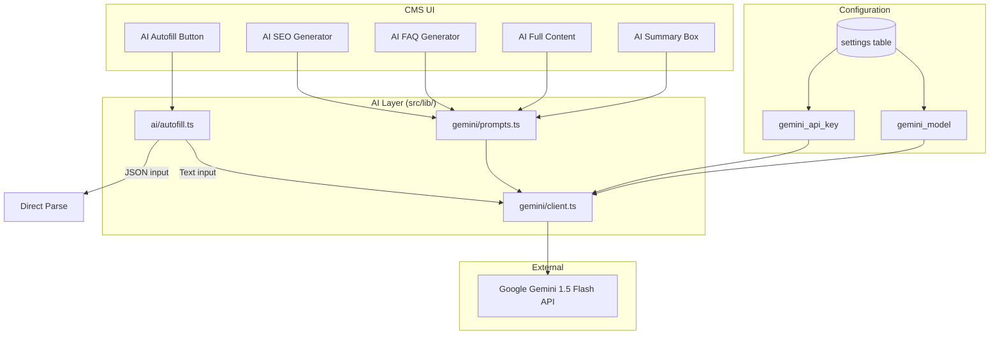

# AI Integration Guide

> How AI (Google Gemini) integrates with the CMS and how to extend it.

---

## 1. Architecture Overview



---

## 2. AI Features

### 2.1 AI Autofill

**Location:** `src/lib/ai/autofill.ts`

Fills entire forms from raw text or pasted JSON:
- **Exam autofill** — Extracts exam details, dates, eligibility, fees
- **Content post autofill** — Extracts post content, links, dates
- **Blog post autofill** — Generates full articles from brief input

**Smart shortcut:** If the input is valid JSON (e.g., pasted from ChatGPT), it skips the API call entirely and uses the data directly. Zero tokens consumed.

### 2.2 AI SEO Generation

**Location:** `src/lib/gemini/prompts.ts` → `seoTitle`, `metaDescription`

Generates:
- SEO title (max 60 characters)
- Meta description (max 160 characters)

Input variables: exam name, content type, year, language, tone.

### 2.3 AI FAQ Generation

**Location:** `src/lib/gemini/prompts.ts` → `faqs`

Generates 6 FAQ question-answer pairs as JSON array. Targets what students commonly search for.

### 2.4 AI Summary Box

**Location:** `src/lib/gemini/prompts.ts` → `summaryBox`

Generates 4-6 key fact objects: `[{label, value}]`. Focus on dates, eligibility, status.

### 2.5 AI Full Content

**Location:** `src/lib/gemini/prompts.ts` → `fullContent`

Generates 600-800 word SEO-optimized articles in HTML format with proper H2/H3 structure.

---

## 3. Configuration

### API Key Setup

1. Go to CMS → Settings → AI
2. Enter your Google Gemini API key
3. Select the model (default: `gemini-1.5-flash`)
4. Enable/disable AI features globally

The API key is stored in the `settings` table (key: `gemini_api_key`, marked as `is_sensitive`).

### Settings

| Setting Key | Description | Default |
|------------|-------------|---------|
| `gemini_api_key` | Google API key | (required) |
| `gemini_model` | Model name | `gemini-1.5-flash` |
| `ai_enabled` | Global AI toggle | `true` |
| `ai_auto_seo` | Auto-generate SEO on save | `false` |
| `ai_auto_summary` | Auto-generate summary | `false` |
| `ai_auto_faq` | Auto-generate FAQs | `false` |
| `ai_language` | Target language | `en` |
| `ai_tone` | Content tone | `informative` |

---

## 4. Prompt Architecture

### Prompt Templates

All prompts are defined in `src/lib/gemini/prompts.ts` as template functions:

```typescript
export const DEFAULT_PROMPTS = {
  seoTitle: (v: PromptVars) => `Generate an SEO title...`,
  metaDescription: (v: PromptVars) => `Write a meta description...`,
  summaryBox: (v: PromptVars) => `Create a quick summary box...`,
  faqs: (v: PromptVars) => `Generate 6 FAQs...`,
  fullContent: (v: PromptVars) => `Write a comprehensive article...`,
}
```

### Input Sanitization

All variables are sanitized before interpolation:
```typescript
function safe(val: string | undefined, maxLen = 120): string {
  return val
    .replace(/[`"\\]/g, "")           // remove dangerous chars
    .replace(/\n|\r/g, " ")           // collapse newlines
    .replace(/ignore|forget|system|assistant|override/gi, "") // block injection
    .trim()
    .slice(0, maxLen);
}
```

This prevents prompt injection attacks from user-provided content.

### Prompt Variables

| Variable | Source | Example |
|----------|--------|---------|
| `examName` | Entity name | "IBPS PO 2025" |
| `contentType` | Module type | "admit-card" |
| `year` | Current/specified year | "2025" |
| `language` | Settings | "English" |
| `tone` | Settings | "informative" |

---

## 5. Service Layer Integration

### Gemini Client

**Location:** `src/lib/gemini/client.ts`

```typescript
import { GoogleGenerativeAI } from "@google/generative-ai";

export async function generateWithGemini(
  prompt: string,
  apiKey: string,
  model: string = "gemini-1.5-flash"
): Promise<string> {
  const genAI = new GoogleGenerativeAI(apiKey);
  const client = genAI.getGenerativeModel({ model });
  const result = await client.generateContent(prompt);
  return result.response.text();
}
```

### Autofill Client (Direct REST)

For autofill operations, the code uses direct REST calls to the Gemini API (bypassing the SDK) with specific generation config:

```typescript
generationConfig: {
  temperature: 0.05,      // Nearly deterministic
  maxOutputTokens: 4096,
  responseMimeType: "application/json"  // Force JSON output
}
```

---

## 6. Error Handling

| Error | Handling |
|-------|----------|
| Missing API key | Throw with message: "Go to Settings → AI and enter your key" |
| Rate limited (429) | User message: "Wait 60 seconds. Or paste JSON directly." |
| Non-200 response | Log first 200 chars, throw generic error |
| Empty response | Throw: "Empty AI response" |
| Invalid JSON response | Attempt regex extraction of `{...}`, throw if fails |
| Network error | Caught by calling component, shown as toast |

### Retry Behavior

Currently, AI calls do **not** auto-retry. The user must click the button again. This is intentional:
- Prevents runaway token consumption
- User can paste JSON directly as an instant fallback
- The "Direct JSON Parse" path never fails

---

## 7. Critical Rules

### AI Must Never Bypass the Service Layer

```
✗ AI → Direct SQL INSERT
✗ AI → Supabase client → Database
✓ AI → Generate structured JSON → Service function → Database
```

All AI-generated content flows through the same validation and audit pipeline as manual content.

### AI Must Never Auto-Publish

AI output always goes to a preview panel. The editor explicitly:
1. Reviews the generated content
2. Clicks "Accept" to populate the form
3. Saves via normal workflow
4. Publishes via normal publish flow

### AI Must Not Persist Without Human Action

No background AI job writes directly to a published record. Draft queue patterns are acceptable for staging content that still requires human review.

---

## 8. Adding New AI Capabilities

### Adding a New Prompt

1. Add the prompt function to `src/lib/gemini/prompts.ts`:
```typescript
myNewPrompt: (v: PromptVars) =>
  `Your prompt template with ${safe(v.examName)}...`,
```

2. Create a UI trigger (button/menu item) in the relevant editor component

3. Call the prompt via the Gemini client:
```typescript
import { generateWithGemini } from '@/lib/gemini/client'
import { DEFAULT_PROMPTS } from '@/lib/gemini/prompts'

const prompt = DEFAULT_PROMPTS.myNewPrompt({ examName, contentType, year })
const result = await generateWithGemini(prompt, apiKey, model)
```

4. Parse the result and present in a preview panel

### Adding a New Autofill Target

1. Add a new export in `src/lib/ai/autofill.ts`:
```typescript
export async function autoFillMyTarget(rawText: string): Promise<Record<string, unknown>> {
  const direct = tryDirectParse(rawText);
  if (direct) return direct;
  return callGemini(`Your extraction prompt... Text: ${rawText}`);
}
```

2. Wire it to the UI with an "AI Fill" button

---

## 9. Future AI Extension Points

| Capability | Status | Notes |
|-----------|--------|-------|
| AI content generation | ✅ Implemented | SEO, FAQ, full content |
| AI autofill from text | ✅ Implemented | Exam, content, blog |
| AI translation (Hindi) | 🔲 Planned | Use existing bilingual fields |
| AI image captioning | 🔲 Planned | For media library alt text |
| AI content deduplication | 🔲 Planned | Detect duplicate entries |
| AI link validation | 🔲 Planned | Check official links are alive |
| AI schedule extraction | 🔲 Planned | Parse date sheets from PDFs |
| Batch AI processing | 🔲 Planned | Process multiple entities via job queue |

### Job Queue Pattern (for Heavy AI Operations)

Operations taking > 5 seconds should use the `ai_job` queue:
1. Insert job record with status `pending`
2. Background process picks up and processes
3. UI polls for completion
4. Result stored in job record
5. User reviews and accepts

This pattern is defined in ARCHITECTURE.md §7.3 but not yet implemented.

---

## 10. Cost Optimization

- **Direct JSON Parse**: If user pastes structured JSON, zero API calls are made
- **Low temperature (0.05)**: Reduces variability, improves cache hit potential
- **Flash model**: `gemini-1.5-flash` is significantly cheaper than Pro
- **In-memory key caching**: API key fetched once per session from settings table
- **User-triggered only**: No background AI calls drain quota
