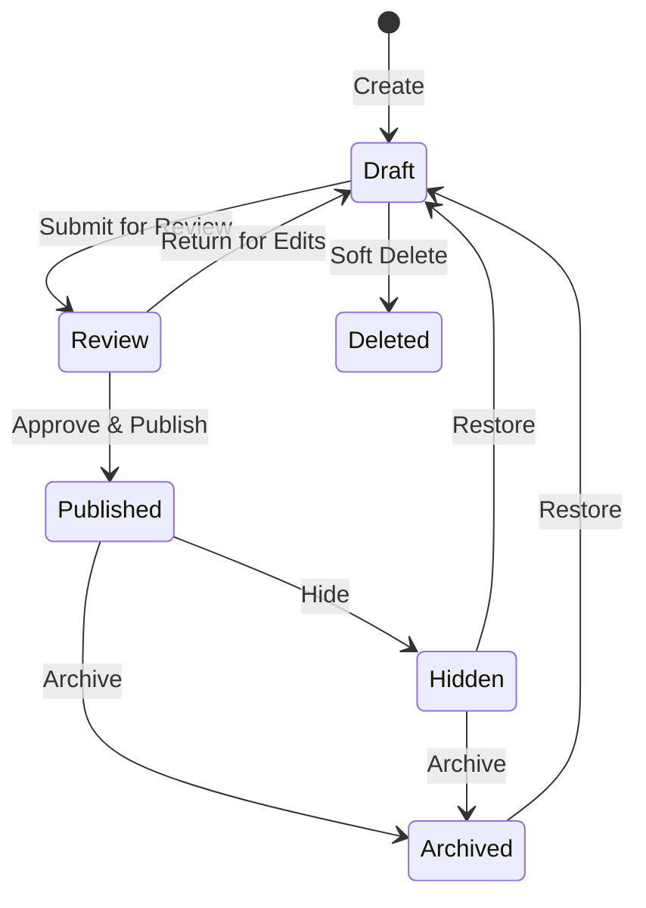
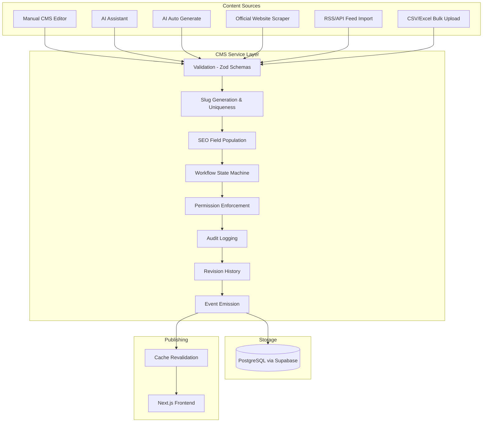
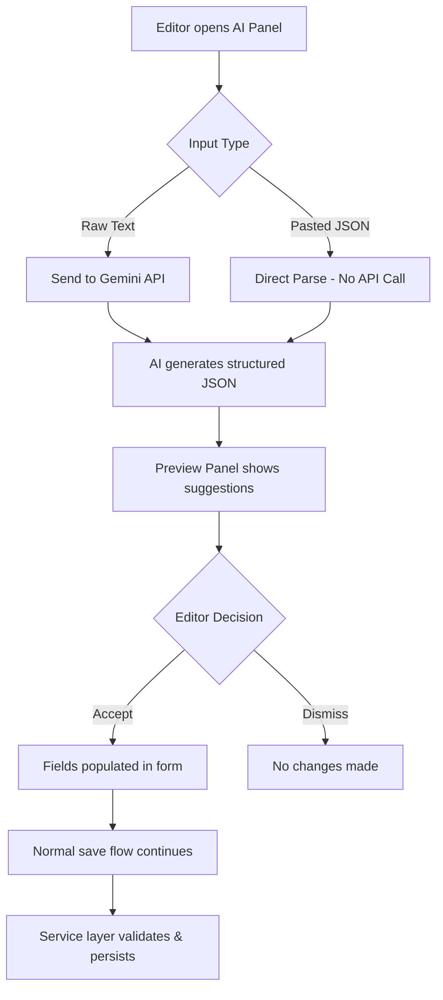
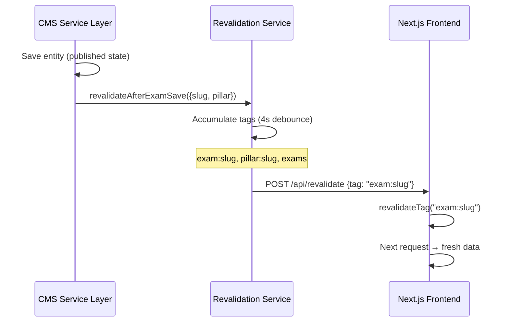

# Content Lifecycle

> How content flows from creation to publication, archival, and deletion.

---

## 1. Lifecycle Overview



---

## 2. Workflow States

| State | Description | Visibility | Editable |
|-------|-------------|-----------|----------|
| `draft` | Work in progress | CMS only | Yes |
| `review` | Awaiting editorial approval | CMS only | Limited |
| `published` | Live on frontend | Public | No (amendments only) |
| `archived` | Removed from frontend, preserved | CMS only | No |
| `hidden` | Temporarily invisible | CMS only | No |
| `deleted` | Soft-deleted, terminal state | Admin only | No |

### Valid Transitions

```typescript
const WORKFLOW_TRANSITIONS = {
  draft:     ['review'],
  review:    ['draft', 'published'],
  published: ['archived', 'hidden'],
  archived:  ['draft'],
  hidden:    ['draft', 'archived'],
  deleted:   [],  // terminal
}
```

---

## 3. Content Flow Diagram



---

## 4. Manual Content Flow

### 4.1 Creating Content

1. Editor navigates to module list page (e.g., `/entities/sarkari-naukri`)
2. Clicks "New Entity" → selects template → enters name
3. System auto-generates slug, creates entity + snapshot + SEO skeleton
4. Editor is redirected to the entity workspace

### 4.2 Editing Content

1. Editor fills in fields across workspace tabs (General, Timeline, Modules, SEO, etc.)
2. **Autosave** is active — changes are persisted after a debounce period
3. Manual "Save" button is available for explicit saves
4. All saves go through Zod validation before touching the database

### 4.3 Submitting for Review

1. Editor clicks "Submit for Review" in the Publishing panel
2. System validates the transition (`draft → review`) is allowed
3. Status updates to `review`
4. Activity log records the transition

### 4.4 Publishing

1. Reviewer clicks "Publish"
2. System checks **publish readiness**:
   - SEO title must be non-empty
   - Meta description must be non-empty
   - All required modules must have content
3. If ready: status → `published`, `published_at` is set
4. A **revision snapshot** is created (full entity state frozen)
5. **Cache revalidation** is triggered for affected frontend pages
6. Activity log records the transition with actor ID

### 4.5 Post-Publish Updates

Published entities cannot be directly edited. Options:
- **Amendments**: Corrections that are tracked separately
- **Archive + Restore**: Archive, edit in draft, re-publish
- **New revision**: Each re-publish creates a new revision

---

## 5. AI-Assisted Content Flow



**Key Rules:**
- AI never writes directly to the database
- AI output always passes through the preview panel
- Editor must explicitly accept before data enters the form
- The service layer performs final validation regardless of source

---

## 6. Lifecycle Rules (Timeline Enforcement)

Templates can define ordering rules between timeline stages:

| Rule Type | Meaning |
|-----------|---------|
| `must_follow` | Stage A date must be AFTER Stage B date |
| `cannot_precede` | Stage A date must NOT be BEFORE Stage B date |
| `requires` | If Stage A has a date, Stage B must also have one |
| `minimum_gap` | Minimum days between two stages |
| `maximum_gap` | Maximum days between two stages |

Rules are evaluated on every timeline event save:
- **Severity `error`** → Blocks the save
- **Severity `warning`** → Shows inline warning, allows save

Example: "Result date must follow Exam date" (`must_follow`, subject=result, object=exam)

---

## 7. Revision History

Every transition to `published` creates an immutable revision snapshot:

```typescript
// Stored in entity_revision table
{
  id: uuid,
  entityId: uuid,
  versionNumber: 1, 2, 3, ...
  snapshot: { /* full EntityFull JSON */ },
  comment: "Published",
  createdBy: userId,
  createdAt: timestamp,
}
```

Revisions enable:
- Viewing historical versions
- Comparing changes between versions
- Rolling back to previous states (via restore to draft)

---

## 8. Content Deletion

### Soft Delete
- Sets `deleted_at` timestamp
- Content disappears from all list views
- Can be restored by admin (clear `deleted_at`)

### Hard Delete
- Reserved for GDPR compliance
- Permanently removes data
- Requires `super-admin` role
- Cascades to satellite tables

---

## 9. Frontend Synchronization



If the frontend is not configured (no `frontend_url` or `revalidate_token` in settings), revalidation is silently skipped.

---

## 10. Archive & Restore

### Archiving
- Removes content from frontend (cache invalidation triggered)
- Content remains in database for reference
- Can be restored to `draft` state

### Restoring
- Changes status back to `draft`
- Content must go through full publish workflow again
- A new revision is created upon re-publish

---

## 11. Scheduled Publishing

Entities support `scheduled_publish_at`:
- Content is saved in `draft` state with a future publish date
- A scheduled job (or Edge Function) transitions to `published` at the specified time
- Currently this is implemented at the UI level — the actual scheduling mechanism depends on Supabase Edge Functions or external cron

---

## 12. Content Provenance

Every record carries optional metadata about its origin:

| Field | Values | Purpose |
|-------|--------|---------|
| `created_via` | `cms_editor`, `ai_assistant`, `ai_auto_generate`, `api`, `import` | How it was created |
| `source_type` | `manual`, `ai_generated`, `scraped`, `rss_feed` | Content source type |
| `created_by` | UUID or NULL | User who created it |

These fields are informational — they do NOT affect workflow or permissions.
