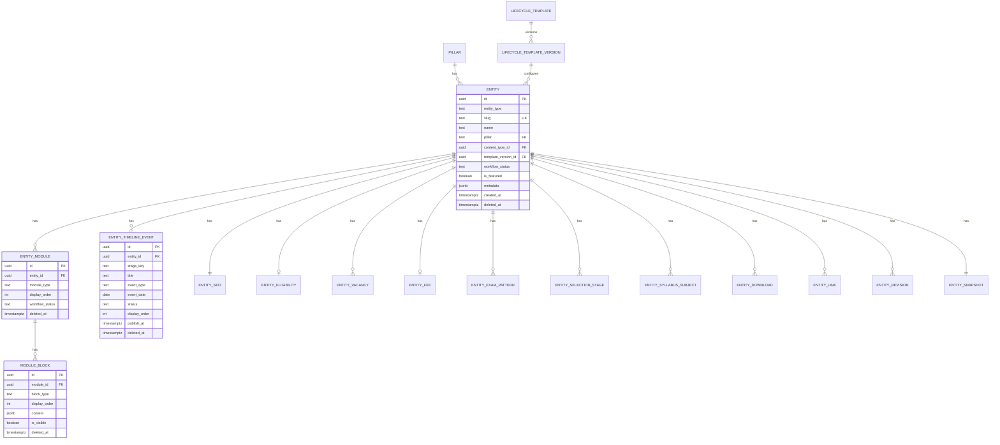

# Database Guide

> Complete reference for the IndianExamInfo CMS PostgreSQL schema (via Supabase).

---

## 1. Overview

The database runs on **Supabase** (managed PostgreSQL). All access from the CMS goes through the Supabase JS client with Row Level Security (RLS) enforced.

**Key Principles:**
- Every table has `deleted_at timestamptz NULL` for soft deletion
- All queries filter `WHERE deleted_at IS NULL`
- Hard DELETE is reserved for GDPR erasure and admin operations
- Structured data lives in dedicated tables (not JSONB blobs)
- All writes go through the service layer

---

## 2. ER Diagram (Core Content OS)



---

## 3. Table Reference

### 3.1 Entity (Core Parent)

**Table: `entity`**

| Column | Type | Description |
|--------|------|-------------|
| `id` | uuid PK | Auto-generated |
| `entity_type` | text | Free-text type (exam, recruitment, board, university) |
| `slug` | text UNIQUE | URL-safe identifier |
| `name` | text NOT NULL | Display name |
| `short_name` | text | Abbreviated name |
| `official_website` | text | Official URL |
| `pillar` | text FK | References `pillar.slug` |
| `content_type_id` | uuid FK | References `content_type.id` |
| `template_version_id` | uuid FK | References `lifecycle_template_version.id` |
| `conducting_body_id` | uuid FK | References `conducting_body.id` |
| `category_id` | uuid FK | References `categories.id` |
| `department_id` | uuid FK | References `department.id` |
| `exam_level_id` | uuid FK | References `exam_level.id` |
| `exam_mode_id` | uuid FK | References `exam_mode.id` |
| `application_mode_id` | uuid FK | References `application_mode.id` |
| `workflow_status` | text | draft/review/published/archived/hidden/deleted |
| `is_featured` | boolean | Featured flag |
| `priority` | int | Sort priority (1-999) |
| `featured_until` | timestamptz | Auto-unfeature date |
| `tags` | text[] | Searchable tags |
| `search_keywords` | text[] | Additional search terms |
| `scheduled_publish_at` | timestamptz | Scheduled publishing |
| `published_at` | timestamptz | Last published timestamp |
| `published_by` | uuid FK | References auth.users |
| `lang` | text | Language code (default: 'en') |
| `last_verified_at` | timestamptz | Content verification timestamp |
| `last_verified_by` | uuid FK | Who verified |
| `metadata` | jsonb | Template-defined dynamic fields |
| `created_at` | timestamptz | Auto-set |
| `updated_at` | timestamptz | Auto-updated (trigger) |
| `created_by` | uuid FK | References auth.users |
| `updated_by` | uuid FK | References auth.users |
| `deleted_at` | timestamptz | Soft delete |

**Indexes:** `slug` (unique), `pillar`, `workflow_status`, `entity_type`, `updated_at DESC`

---

### 3.2 Entity Snapshot

**Table: `entity_snapshot`**

Stores the immutable template configuration frozen at entity creation time.

| Column | Type | Description |
|--------|------|-------------|
| `entity_id` | uuid PK/FK | References `entity.id` |
| `snapshot` | jsonb NOT NULL | Full `TemplateConfiguration` object |
| `created_at` | timestamptz | When snapshot was created |

**Purpose:** Decouples entity behavior from template evolution. Once created, an entity's configuration never changes even if the template is updated.

---

### 3.3 Entity Module

**Table: `entity_module`**

| Column | Type | Description |
|--------|------|-------------|
| `id` | uuid PK | Auto-generated |
| `entity_id` | uuid FK | Parent entity |
| `module_type` | text | Free-text module type |
| `sub_title` | text | Distinguishes multiple modules of same type |
| `display_order` | int | Sort order |
| `workflow_status` | text | Independent status per module |
| `is_featured` | boolean | Module-level featuring |
| `tags` | text[] | Module-level tags |
| `scheduled_publish_at` | timestamptz | Module scheduling |
| `published_at` | timestamptz | When module was published |
| `published_by` | uuid FK | Who published |
| `seo_override_title` | text | Override parent SEO |
| `seo_override_desc` | text | Override parent SEO |
| `metadata` | jsonb | Module-specific data |
| `created_at` | timestamptz | Auto-set |
| `updated_at` | timestamptz | Auto-updated |
| `deleted_at` | timestamptz | Soft delete |

---

### 3.4 Module Block

**Table: `module_block`**

| Column | Type | Description |
|--------|------|-------------|
| `id` | uuid PK | Auto-generated |
| `module_id` | uuid FK | Parent module |
| `block_type` | text | Registry-driven type |
| `display_order` | int | Sort order |
| `content` | jsonb | Block-specific content |
| `is_visible` | boolean | Toggle visibility |
| `created_at` | timestamptz | Auto-set |
| `updated_at` | timestamptz | Auto-updated |
| `deleted_at` | timestamptz | Soft delete |

---

### 3.5 Timeline Events

**Table: `entity_timeline_event`**

| Column | Type | Description |
|--------|------|-------------|
| `id` | uuid PK | Auto-generated |
| `entity_id` | uuid FK | Parent entity |
| `stage_key` | text | References template stage definition |
| `event_subtype` | text | Subtype within stage |
| `title` | text NOT NULL | Event title |
| `event_type` | text NOT NULL | Event category |
| `event_date` | date | When event occurs |
| `event_time` | text | Time of day |
| `description` | text | Event description |
| `status` | text | pending/upcoming/active/passed/postponed/cancelled |
| `badge_color` | text | UI badge color |
| `is_highlighted` | boolean | Visual emphasis |
| `is_featured` | boolean | Featured in timeline |
| `official_link` | text | Official source URL |
| `pdf_link` | text | PDF document URL |
| `image_url` | text | Associated image |
| `visibility` | text | public/logged_in/admin |
| `display_order` | int | Sort order |
| `publish_at` | timestamptz | Scheduled visibility |
| `created_at` | timestamptz | Auto-set |
| `updated_at` | timestamptz | Auto-updated |
| `deleted_at` | timestamptz | Soft delete |

---

### 3.6 CMS Results

**Table: `cms_results`**

| Column | Type | Description |
|--------|------|-------------|
| `id` | uuid PK | Auto-generated |
| `slug` | text UNIQUE | URL-safe identifier |
| `title` | text NOT NULL | Result title (English) |
| `title_hindi` | text | Hindi title |
| `result_date` | date NOT NULL | Declaration date |
| `expected_date` | date | Expected date (if not declared) |
| `organization` | text NOT NULL | Conducting body |
| `organization_hindi` | text | Hindi organization name |
| `category` | text | civil-services, ssc, railway, etc. |
| `description` | text | HTML content |
| `result_link` | text | Official result URL |
| `alternate_links` | jsonb | Array of alternate links |
| `total_candidates` | int | Total appeared |
| `pass_percentage` | numeric | Pass rate |
| `cutoff_marks` | text | Category-wise cutoffs |
| `result_status` | text | declared/expected/delayed |
| `is_new` | boolean | New badge flag |
| `is_featured` | boolean | Featured flag |
| `status` | text | draft/pending_review/approved/published/archived |
| `published_at` | timestamptz | Published timestamp |
| `created_by` | uuid FK | Who created |
| `created_at` | timestamptz | Auto-set |
| `updated_at` | timestamptz | Auto-updated |

---

### 3.7 CMS Education News

**Table: `cms_education_news`**

| Column | Type | Description |
|--------|------|-------------|
| `id` | uuid PK | Auto-generated |
| `slug` | text UNIQUE | URL-safe identifier |
| `title` | text NOT NULL | News title (English) |
| `title_hindi` | text | Hindi title |
| `category` | text NOT NULL | government-jobs, banking, defence, etc. |
| `excerpt` | text | Short summary |
| `content` | text | Full HTML content |
| `source` | text | News source name |
| `source_link` | text | Source URL |
| `author` | text | Author name |
| `is_breaking` | boolean | Breaking news flag |
| `is_important` | boolean | Important flag |
| `is_featured` | boolean | Featured flag |
| `related_exams` | jsonb | Linked exam references |
| `related_results` | jsonb | Linked result references |
| `tags` | jsonb | Tags array |
| `status` | text | draft/pending_review/approved/published/archived |
| `published_at` | timestamptz | Published timestamp |
| `created_by` | uuid FK | Who created |
| `created_at` | timestamptz | Auto-set |
| `updated_at` | timestamptz | Auto-updated |

---

### 3.8 Taxonomy Tables

All taxonomy tables share the same base schema:

| Column | Type | Description |
|--------|------|-------------|
| `id` | uuid PK | Auto-generated |
| `slug` | text UNIQUE | URL-safe identifier |
| `label` | text NOT NULL | Display name |
| `usage_count` | int | How many entities reference this |
| `is_active` | boolean | Enabled/disabled |
| `created_via` | text | 'taxonomy_manager' or 'inline_create' |
| `created_at` | timestamptz | Auto-set |
| `created_by` | uuid FK | Who created |
| `updated_at` | timestamptz | Auto-updated |
| `deleted_at` | timestamptz | Soft delete |

**Tables:** `conducting_body`, `department`, `tag`, `exam_level`, `exam_mode`, `application_mode`

---

### 3.9 Auth & Permissions

**`user_profiles`** — Extends Supabase Auth users with CMS profile data
**`roles`** — System roles (super-admin, admin, editor, author, advertiser)
**`permissions`** — Individual permission slugs (30+ defined)
**`role_permissions`** — Many-to-many join (role ↔ permission)

---

### 3.10 Settings

**Table: `settings`**

| Column | Type | Description |
|--------|------|-------------|
| `id` | uuid PK | Auto-generated |
| `key` | text UNIQUE | Setting identifier |
| `value` | jsonb | Setting value |
| `group` | text | UI grouping (general, ai, seo, integrations, etc.) |
| `label` | text | Human-readable label |
| `description` | text | Help text |
| `is_sensitive` | boolean | Hide value in UI |
| `updated_at` | timestamptz | Last modified |
| `updated_by` | uuid FK | Who modified |

---

## 4. Common Queries

### Get entity with full context
```sql
SELECT e.*, es.snapshot
FROM entity e
LEFT JOIN entity_snapshot es ON es.entity_id = e.id
WHERE e.id = $1 AND e.deleted_at IS NULL;
```

### List entities for a pillar
```sql
SELECT id, entity_type, slug, name, pillar, workflow_status, is_featured, updated_at
FROM entity
WHERE pillar = $1 AND deleted_at IS NULL
ORDER BY updated_at DESC
LIMIT 50;
```

### Get timeline events for entity
```sql
SELECT * FROM entity_timeline_event
WHERE entity_id = $1 AND deleted_at IS NULL
ORDER BY display_order ASC, event_date ASC;
```

### Search across all content
```sql
SELECT id, name, slug, entity_type, pillar
FROM entity
WHERE deleted_at IS NULL AND name ILIKE '%' || $1 || '%'
ORDER BY updated_at DESC LIMIT 20;
```

---

## 5. Migration Guidelines

1. One migration = one concern (one table, one index set, one trigger)
2. Always use `IF NOT EXISTS` / `ON CONFLICT DO NOTHING`
3. Never drop columns without a deprecation period
4. Never insert content rows in migrations (use the service layer)
5. Test migrations on a branch database first (Supabase branching)

---

## 6. RLS Policies

All tables have Row Level Security enabled. The general pattern:
- **SELECT**: Allowed for authenticated users with appropriate role
- **INSERT/UPDATE/DELETE**: Restricted to users with specific permissions
- The `current_user_role()` database function returns the current user's role slug

---

## 7. Performance Notes

- Entity lists use **keyset pagination** (cursor on `updated_at`) — no OFFSET
- Satellite table queries are parallelized in `getEntityFull()`
- Use composite indexes for frequently filtered combinations (`pillar + workflow_status`)
- JSONB columns (`metadata`, `content`) should not be queried — use dedicated columns for filterable data
- The `entity_snapshot` table was split from `entity` to keep the main table lean for list queries
