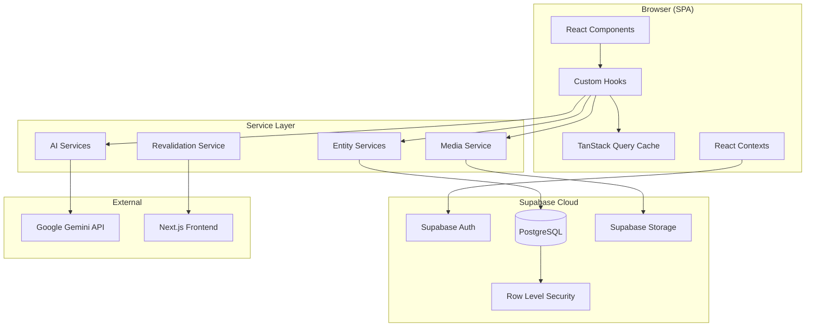
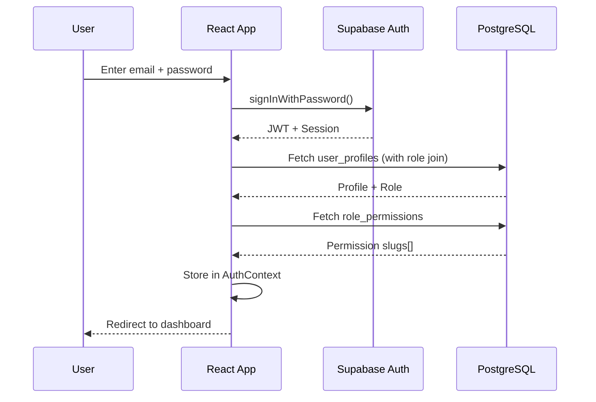
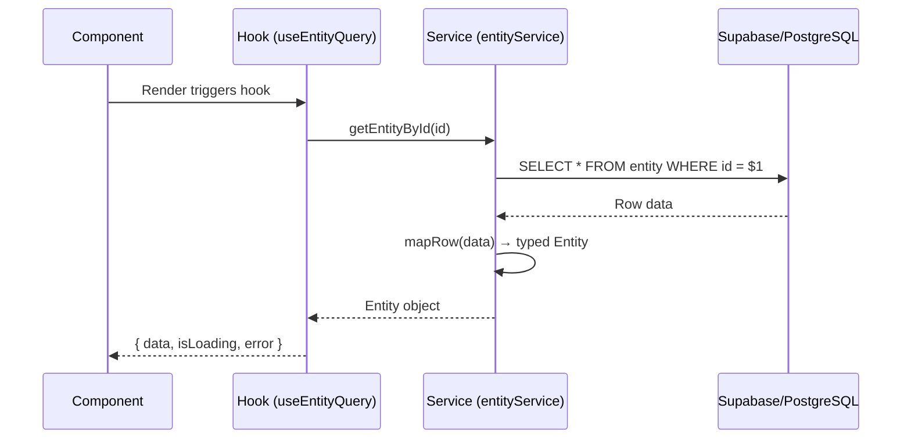
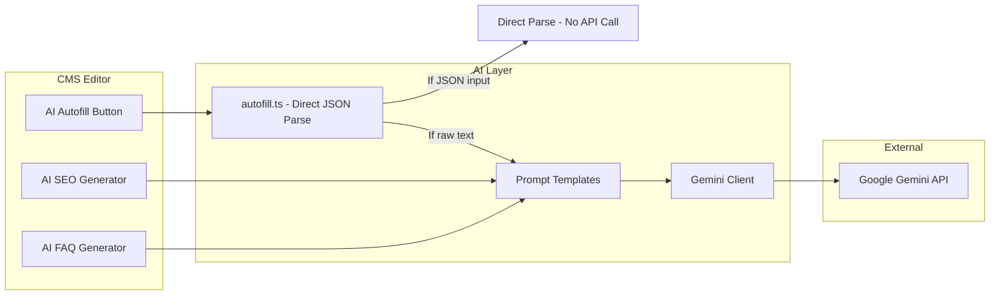
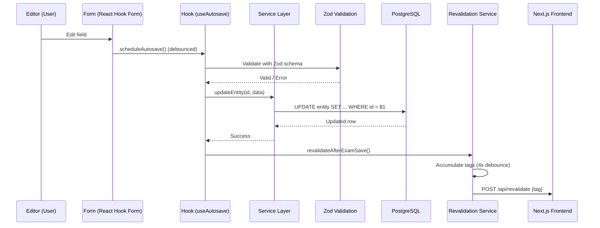

# System Architecture

> IndianExamInfo Content OS — Complete Technical Architecture Reference

---

## 1. Overview

IndianExamInfo CMS is a **React SPA** (Single Page Application) that manages educational content for the Indian exam preparation ecosystem. It is a headless CMS backed by **Supabase** (PostgreSQL + Auth + Storage) with AI-powered content generation via **Google Gemini**.

### Technology Stack

| Layer | Technology |
|-------|-----------|
| Frontend Framework | React 18 + TypeScript |
| Build Tool | Vite 5 |
| State Management | TanStack Query v5 (server state) + React Context (auth/settings) |
| Routing | React Router v6 |
| UI Components | Radix UI + Tailwind CSS + shadcn/ui patterns |
| Rich Text Editor | Tiptap v2 |
| Form Management | React Hook Form + Zod validation |
| Drag & Drop | @dnd-kit |
| Backend | Supabase (PostgreSQL + Auth + Storage + RLS) |
| AI | Google Gemini 1.5 Flash |
| Deployment | PM2 + Nginx (static SPA serving) |
| CI/CD | GitHub Actions |

### Core Design Principles

1. **Entity-first architecture** — All content is an `entity`. Entity types are data, not code.
2. **Plugin-driven extensibility** — New block types, module types, and content types require zero changes to existing code.
3. **Service layer mandate** — All database access goes through typed services. Components never touch Supabase directly.
4. **AI as assistant, never author** — AI generates suggestions; humans review and publish.
5. **Template-driven configuration** — Entity behavior (fields, modules, lifecycle rules) is defined by immutable template snapshots.

---

## 2. High-Level Architecture



---

## 3. Frontend Architecture

### 3.1 Component Hierarchy

```mermaid
graph TD
    App[App.tsx] --> AuthProvider
    AuthProvider --> SettingsProvider
    SettingsProvider --> QueryClientProvider
    QueryClientProvider --> Router

    Router --> LoginPage
    Router --> ProtectedRoute
    ProtectedRoute --> AppShell

    AppShell --> Sidebar
    AppShell --> PageContent

    PageContent --> EntityListPage
    PageContent --> EntityEditorPage
    PageContent --> DashboardPage
    PageContent --> "Other Pages..."

    EntityEditorPage --> EntityEditorShell
    EntityEditorShell --> WorkspaceNav
    EntityEditorShell --> EditorPanels["Editor Panels (lazy)"]
```

### 3.2 Directory Structure

```
src/
├── components/
│   ├── blocks/           # Block editor system (editors + renderers)
│   ├── layout/           # AppShell, Sidebar, Header
│   ├── shared/           # Reusable UI (FormField, DraggableList, etc.)
│   └── workspace/        # Entity workspace modules (registry-driven)
├── config/
│   ├── env.ts            # Environment variables
│   ├── contentTypeFields.ts  # Legacy content type field definitions
│   ├── moduleRegistry.ts     # Module definitions + entity type profiles
│   └── permissions.ts        # Permission slug constants
├── contexts/
│   ├── AuthContext.tsx    # Authentication state
│   ├── PillarContext.tsx  # Active pillars
│   └── SettingsContext.tsx# CMS settings
├── hooks/                # Custom React hooks (useEntityQuery, useAutosave, etc.)
├── lib/
│   ├── ai/              # AI autofill logic
│   ├── blocks/          # Block registry + schemas + core registrations
│   ├── gemini/          # Gemini API client + prompt templates
│   ├── revalidation/    # Frontend cache invalidation
│   ├── supabase/        # Supabase client + generated types
│   └── validation/      # Zod schemas for all forms
├── pages/               # Route-level page components (lazy-loaded)
├── router/              # React Router configuration
├── services/            # Data access layer (NO React imports)
│   ├── entity/          # Entity-related services
│   └── template/        # Template/snapshot services
└── types/               # TypeScript type definitions
```

### 3.3 Lazy Loading Strategy

All page components are lazy-loaded via `React.lazy()` with a custom error boundary that handles chunk-load failures:
- First retry: Re-attempt the chunk load
- Second retry: Full page reload

### 3.4 State Management

| State Type | Tool | Example |
|-----------|------|---------|
| Server state | TanStack Query | Entity data, lists, modules |
| Auth state | React Context | User profile, permissions |
| Settings | React Context | CMS configuration from `settings` table |
| Form state | React Hook Form | All editor forms |
| UI state | Component state | Modals, tabs, collapse states |

---

## 4. Backend Architecture (Supabase)

### 4.1 Database Organization

The database is organized into functional domains:

| Domain | Tables |
|--------|--------|
| Content OS (New) | `entity`, `entity_module`, `module_block`, `entity_timeline_event`, `entity_seo`, `entity_eligibility`, `entity_vacancy`, `entity_fee`, `entity_exam_pattern`, `entity_selection_stage`, `entity_syllabus_subject`, `entity_download`, `entity_link`, `entity_media_slot`, `entity_revision`, `entity_activity_log`, `entity_event_log`, `entity_snapshot`, `entity_slug_history` |
| Legacy Content | `exams`, `content_posts`, `blog_posts`, `pages` |
| CMS Results | `cms_results`, `cms_education_news` |
| Taxonomy | `categories`, `pillar`, `lifecycle_template`, `lifecycle_template_version`, `conducting_body`, `department`, `tag`, `exam_level`, `exam_mode`, `application_mode`, `content_type` |
| Media | `media` |
| Navigation | `menus`, `menu_items` |
| Advertising | `advertisers`, `ad_campaigns`, `ad_creatives`, `ad_zones`, `ad_reports` |
| Auth/Users | `user_profiles`, `roles`, `permissions`, `role_permissions` |
| System | `settings`, `audit_log` |

### 4.2 Authentication Flow



### 4.3 Authorization Model

```
User → user_profiles.role_id → roles → role_permissions → permissions
```

**Roles** (seeded, system-level):
- `super-admin` — Full access
- `admin` — All content + user management
- `editor` — Create/edit/publish content
- `author` — Create/edit own content
- `advertiser` — View own ad campaigns

**Permission Check Pattern:**
```typescript
const { permissions } = useAuth();
const canPublish = permissions.includes('publish_entity');
```

---

## 5. Service Layer

### 5.1 Architecture Rules

1. Services live in `src/services/` — never import React
2. Each service owns ONE database table/domain
3. Every service has a named `mapRow()` function for DB→TypeScript mapping
4. All exported functions have explicit return types
5. Business logic (validation, state transitions) lives in services, not components

### 5.2 Service Call Flow



### 5.3 Key Services

| Service | Domain | Key Methods |
|---------|--------|-------------|
| `entityService.ts` | Entity CRUD | `listEntities`, `getEntityById`, `createEntity`, `updateEntity`, `transitionWorkflow` |
| `timelineService.ts` | Timeline events | `listTimeline`, `createTimelineEvent`, `evaluateLifecycleRules` |
| `moduleService.ts` | Entity modules | `listModules`, `createModule`, `publishModule`, `reorderModules` |
| `mediaService.ts` | File uploads | `uploadMedia`, `getMediaItems`, `deleteMedia` |
| `resultService.ts` | Sarkari Results | `listResults`, `createResult`, `publishResult` |
| `educationNewsService.ts` | Education News | `listEducationNews`, `createEducationNews` |
| `revalidationService.ts` | Cache invalidation | `revalidateAfterExamSave`, `revalidateAfterModuleSave` |

---

## 6. AI Integration Architecture



**Critical Rule**: AI output ALWAYS goes through a preview panel. The editor clicks "Accept" to insert. AI never auto-publishes or writes directly to the database.

---

## 7. Data Flow

### 7.1 Content Save Flow



### 7.2 Revalidation Strategy

The revalidation service uses **intelligent batched invalidation**:
- Saves accumulate tags in a 4-second debounce window
- Multiple rapid saves → one batched revalidation request
- Failed batches retry with exponential backoff (10s, 30s, 60s)
- Max 3 retry attempts before giving up (logged for admin)

**Tag Strategy (Next.js App Router):**
- `exam:{slug}` → All pages rendering this exam
- `pillar:{slug}` → Listing pages for that pillar
- `hub:{contentType}` → Hub pages (admit-card, results, etc.)
- `exams` → Global exam caches (homepage, search)

---

## 8. Block System Architecture

The content block system is a **plugin registry** pattern:

```mermaid
graph TD
    subgraph "Registration (main.tsx)"
        CB[registerCoreBlocks()]
    end

    subgraph "Block Registry (Singleton Map)"
        REG[blockRegistry.ts]
        REG -->|stores| BD[BlockDefinition]
    end

    subgraph "BlockDefinition"
        BD --> TYPE[type: string]
        BD --> LABEL[label: string]
        BD --> ICON[icon: Component]
        BD --> EDITOR[editor: Component]
        BD --> RENDERER[renderer: Component]
        BD --> SCHEMA[schema: ZodSchema]
        BD --> DEFAULT[defaultContent]
    end

    subgraph "Usage"
        BR[BlockRenderer] -->|get(blockType)| REG
        ABM[AddBlockMenu] -->|getAll()| REG
    end

    CB -->|register()| REG
```

**14 Built-in Block Types**: heading, paragraph, rich_text, image, gallery, button, download_card, table, quote, alert_box, divider, video, faq, timeline_reference, (html — feature-flagged)

**Adding a new block type** requires:
1. Create a Zod schema in `src/lib/blocks/schemas/`
2. Create an Editor component in `src/components/blocks/editors/`
3. Create a Renderer component in `src/components/blocks/renderers/`
4. Call `register()` in `coreBlocks.ts`
5. Zero changes to `BlockRenderer`, `AddBlockMenu`, or any shared component

---

## 9. Search Architecture

The CMS uses **Supabase's built-in text search** via `ilike` queries on indexed columns:
- Entity search: `name ILIKE '%query%'`
- Result search: `title ILIKE '%query%' OR organization ILIKE '%query%'`
- News search: `title ILIKE '%query%' OR category ILIKE '%query%'`

The frontend application uses separate search indexing (not covered here).

---

## 10. Caching Strategy

| Layer | Mechanism | TTL |
|-------|-----------|-----|
| TanStack Query | In-memory cache | `staleTime` per query key |
| Settings | Context cache | Until page reload or manual refresh |
| Revalidation config | Module-level variable | 5 minutes |
| Gemini API key | Module-level variable | Session lifetime |
| Frontend (Next.js) | Tag-based revalidation | On-demand via CMS |

---

## 11. Error Handling

### 11.1 Service Layer
- Services throw errors with descriptive messages
- Unique constraint violations are caught and re-thrown with user-friendly text
- Workflow transitions validate against `WORKFLOW_TRANSITIONS` map

### 11.2 Component Layer
- TanStack Query provides `error` state in hooks
- `sonner` toast notifications for user-facing errors
- `LazyErrorBoundary` catches chunk-load failures

### 11.3 AI Layer
- Rate limit (429) errors → user-friendly message with cooldown suggestion
- Empty responses → specific error message
- JSON parse failures → fallback regex extraction

---

## 12. Logging

| What | Where | Method |
|------|-------|--------|
| Audit events | `audit_log` table | Service layer inserts |
| Entity activity | `entity_activity_log` table | On workflow transitions, verification |
| Entity events | `entity_event_log` table | On status changes |
| Revalidation failures | Browser console | `console.warn` after max retries |
| Auth errors | Browser console | `console.error` in AuthContext |

---

## 13. Performance Considerations

1. **Lazy loading** — All page components are code-split
2. **Parallel data fetching** — `getEntityFull()` fetches 12 satellite tables in parallel via `Promise.all`
3. **Keyset pagination** — Entity lists use cursor-based pagination (no OFFSET)
4. **Debounced saves** — Autosave uses configurable debounce (prevents DB thrashing)
5. **Batched revalidation** — Multiple saves within 4s produce one revalidation call
6. **Registry pattern** — Block/module lookups are O(1) Map operations
7. **Config caching** — Revalidation config cached for 5 minutes
8. **Query key factory** — `queryKeys.ts` prevents typos and enables precise cache invalidation

---

## 14. Security Architecture

1. **Row Level Security (RLS)** — All tables have RLS policies enforced by Supabase
2. **JWT-based auth** — Supabase Auth issues JWTs; client sends in every request
3. **Permission-based UI** — Components check `permissions[]` before rendering actions
4. **Input sanitization** — AI prompts strip injection keywords; media filenames are randomized
5. **Path traversal prevention** — Media uploads use an allowlist of folder names
6. **File validation** — Upload size and MIME type are validated client-side
7. **Security headers** — Nginx adds X-Frame-Options, X-Content-Type-Options, Referrer-Policy
