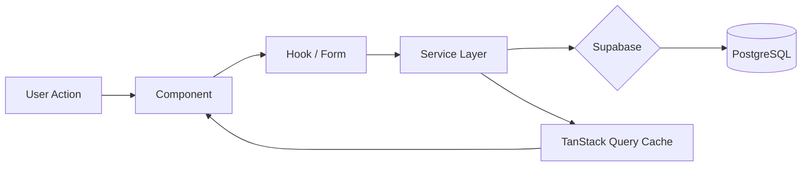

# Architecture Overview Diagram

```mermaid
graph TB
    subgraph "Browser (SPA)"
        direction TB
        UI[React 18 Components]
        RQ[TanStack Query v5]
        CTX[React Contexts<br/>Auth | Settings | Pillar]
        FORM[React Hook Form + Zod]
        ROUTER[React Router v6]
    end

    subgraph "Service Layer (src/services/)"
        direction TB
        ES[Entity Services<br/>entity, timeline, module,<br/>seo, eligibility, etc.]
        CS[Content Services<br/>result, news, blog,<br/>content, page]
        MS[Media Service]
        AI[AI Services<br/>autofill, gemini client]
        RS[Revalidation Service]
    end

    subgraph "Supabase Cloud"
        direction TB
        AUTH[Auth<br/>JWT + Sessions]
        DB[(PostgreSQL<br/>30+ tables)]
        STR[Storage<br/>Media bucket]
        RLS[Row Level Security]
    end

    subgraph "External Services"
        GEM[Google Gemini API<br/>1.5 Flash]
        FE[Next.js Frontend<br/>indianexaminfo.com]
    end

    UI --> RQ --> ES
    UI --> FORM
    FORM --> ES
    CTX --> AUTH
    ES --> DB
    CS --> DB
    MS --> STR
    AI --> GEM
    RS --> FE
    DB --> RLS --> AUTH
```

## Data Flow Summary


