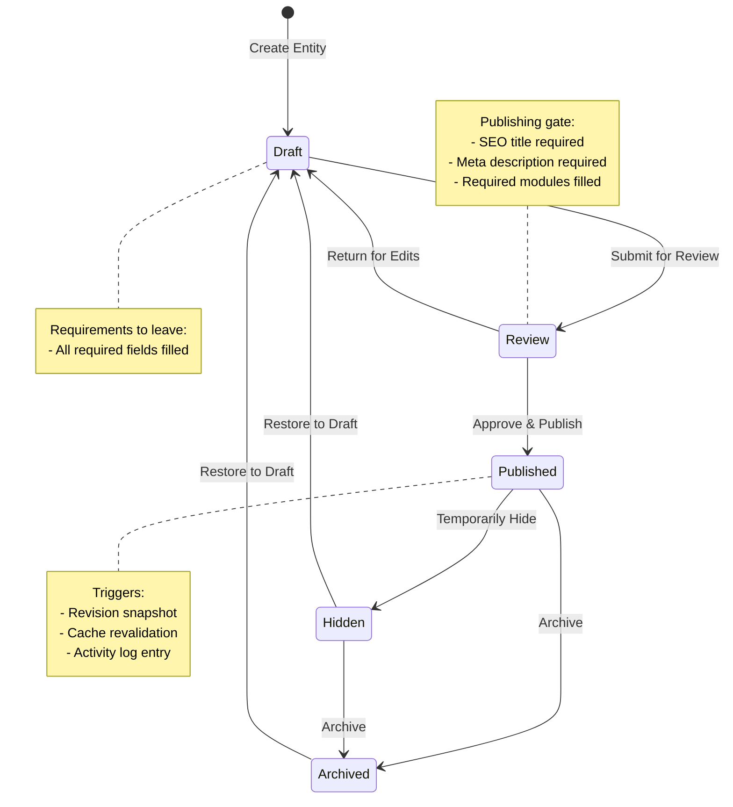
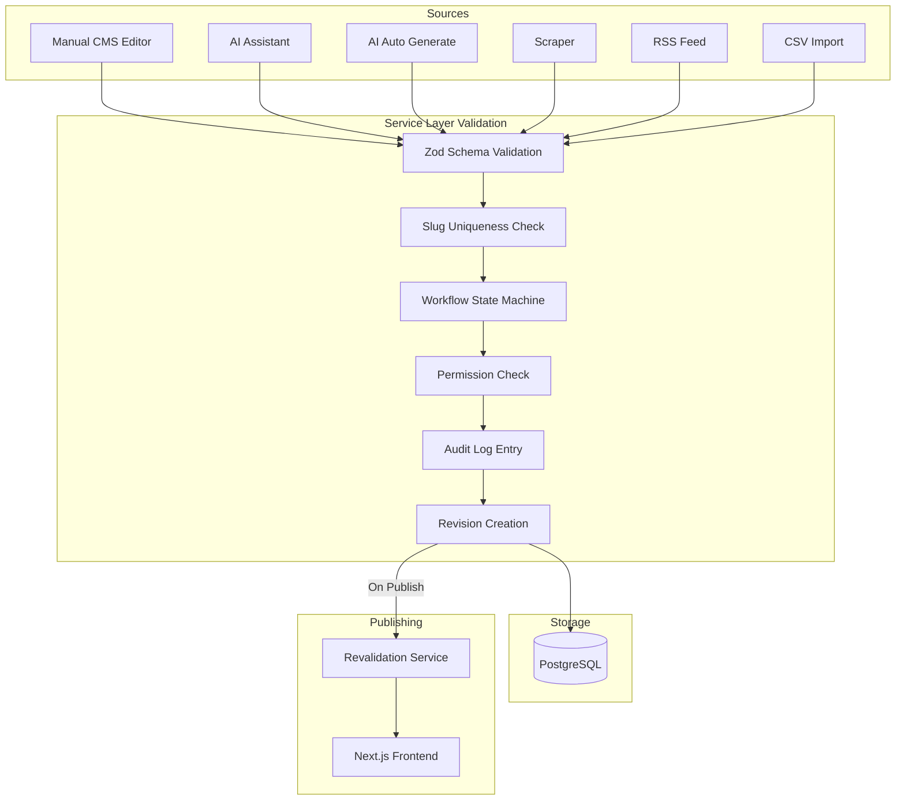
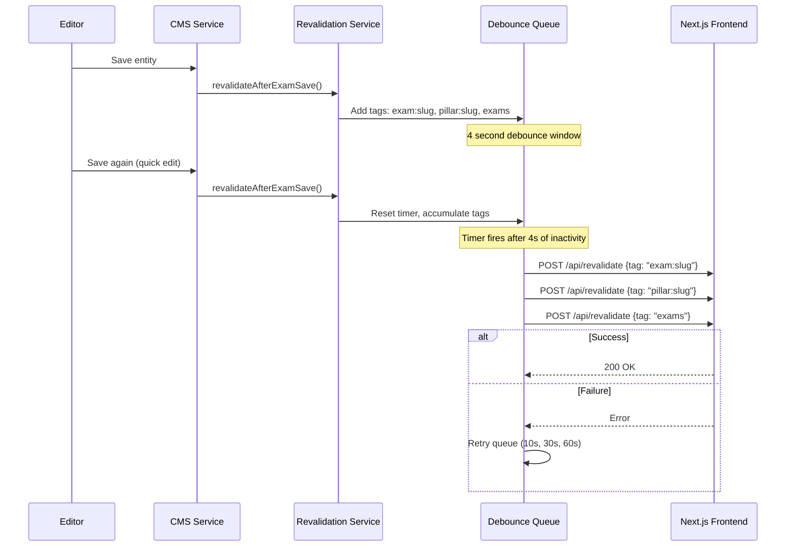

# Content Lifecycle Diagrams

## Workflow State Machine

```mermaid
stateDiagram-v2
    [*] --> Draft: Create Entity
    Draft --> Review: Submit for Review
    Review --> Draft: Return for Edits
    Review --> Published: Approve & Publish
    Published --> Archived: Archive
    Published --> Hidden: Temporarily Hide
    Hidden --> Draft: Restore to Draft
    Hidden --> Archived: Archive
    Archived --> Draft: Restore to Draft

    note right of Published
        Triggers:
        - Revision snapshot
        - Cache revalidation
        - Activity log entry
    end note

    note right of Draft
        Requirements to leave:
        - All required fields filled
    end note

    note left of Review
        Publishing gate:
        - SEO title required
        - Meta description required
        - Required modules filled
    end note
```

## Content Source Flow

```mermaid
flowchart TD
    subgraph Sources
        M[Manual CMS Editor]
        AI[AI Assistant]
        AG[AI Auto Generate]
        SC[Scraper]
        RSS[RSS Feed]
        CSV[CSV Import]
    end

    subgraph "Service Layer Validation"
        V[Zod Schema Validation]
        SL[Slug Uniqueness Check]
        WF[Workflow State Machine]
        P[Permission Check]
        A[Audit Log Entry]
        R[Revision Creation]
    end

    subgraph Storage
        DB[(PostgreSQL)]
    end

    subgraph Publishing
        RV[Revalidation Service]
        FE[Next.js Frontend]
    end

    M --> V
    AI --> V
    AG --> V
    SC --> V
    RSS --> V
    CSV --> V

    V --> SL --> WF --> P --> A --> R --> DB
    R -->|On Publish| RV --> FE
```

## Revalidation Flow

```mermaid
sequenceDiagram
    participant E as Editor
    participant CMS as CMS Service
    participant RV as Revalidation Service
    participant Q as Debounce Queue
    participant FE as Next.js Frontend

    E->>CMS: Save entity
    CMS->>RV: revalidateAfterExamSave()
    RV->>Q: Add tags: exam:slug, pillar:slug, exams

    Note over Q: 4 second debounce window

    E->>CMS: Save again (quick edit)
    CMS->>RV: revalidateAfterExamSave()
    RV->>Q: Reset timer, accumulate tags

    Note over Q: Timer fires after 4s of inactivity

    Q->>FE: POST /api/revalidate {tag: "exam:slug"}
    Q->>FE: POST /api/revalidate {tag: "pillar:slug"}
    Q->>FE: POST /api/revalidate {tag: "exams"}

    alt Success
        FE-->>Q: 200 OK
    else Failure
        FE-->>Q: Error
        Q->>Q: Retry queue (10s, 30s, 60s)
    end
```
