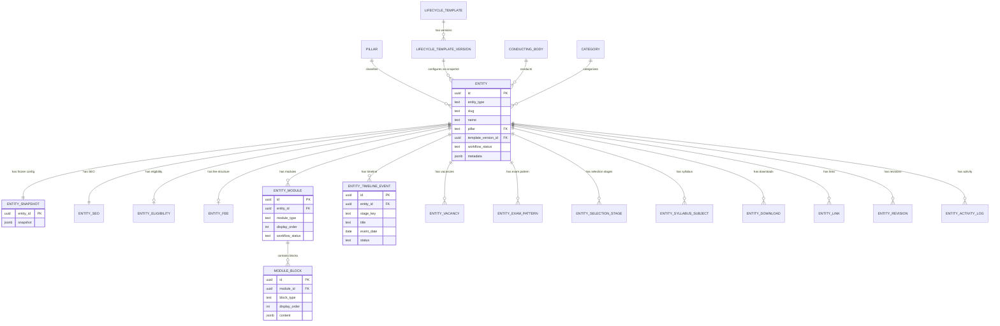
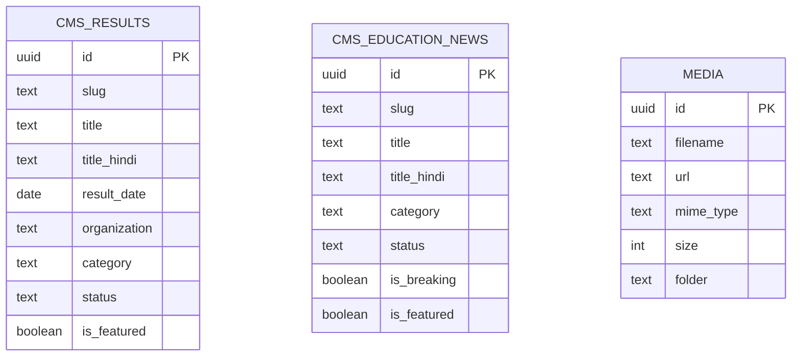
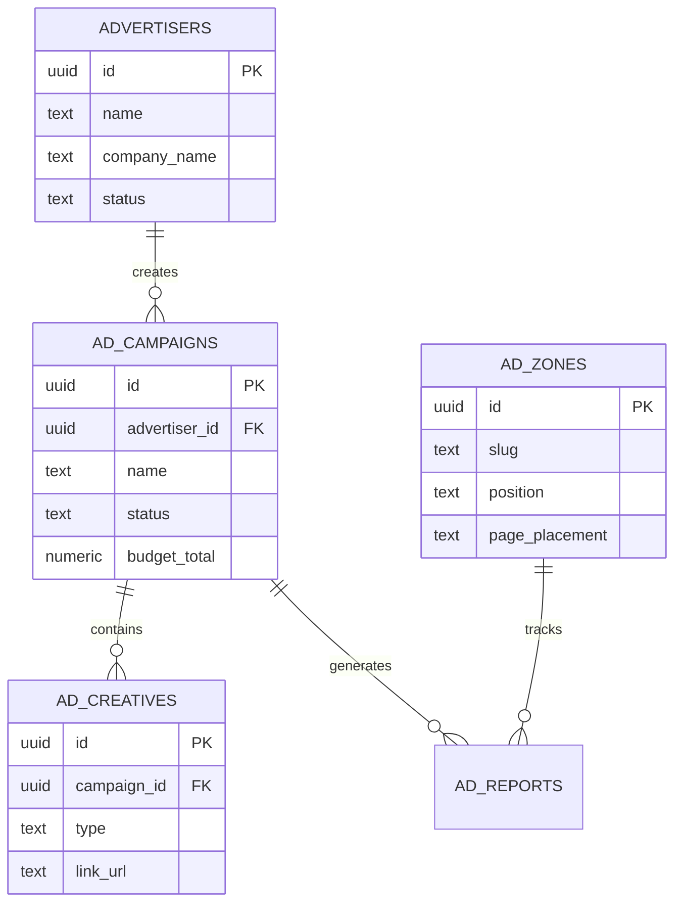

# Entity Relationship Diagrams

## Core Content OS Schema



## Auth & Permissions Schema

```mermaid
erDiagram
    AUTH_USERS ||--|| USER_PROFILES : "extends"
    USER_PROFILES }o--|| ROLES : "has role"
    ROLES ||--o{ ROLE_PERMISSIONS : "has"
    ROLE_PERMISSIONS }o--|| PERMISSIONS : "grants"

    USER_PROFILES {
        uuid id PK_FK
        text name
        text avatar
        uuid role_id FK
        boolean is_active
    }

    ROLES {
        uuid id PK
        text slug
        text name
        boolean is_system
    }

    PERMISSIONS {
        uuid id PK
        text slug
        text label
        text group
    }

    ROLE_PERMISSIONS {
        uuid role_id FK
        uuid permission_id FK
    }
```

## CMS Results & News Schema



## Advertising Schema


